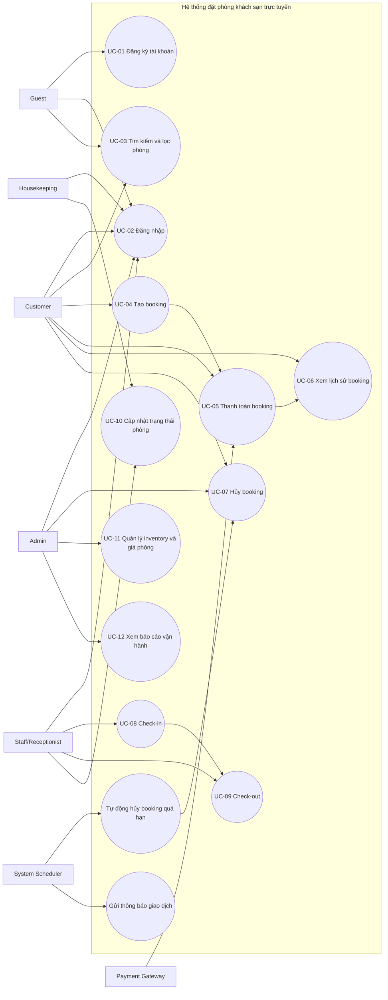
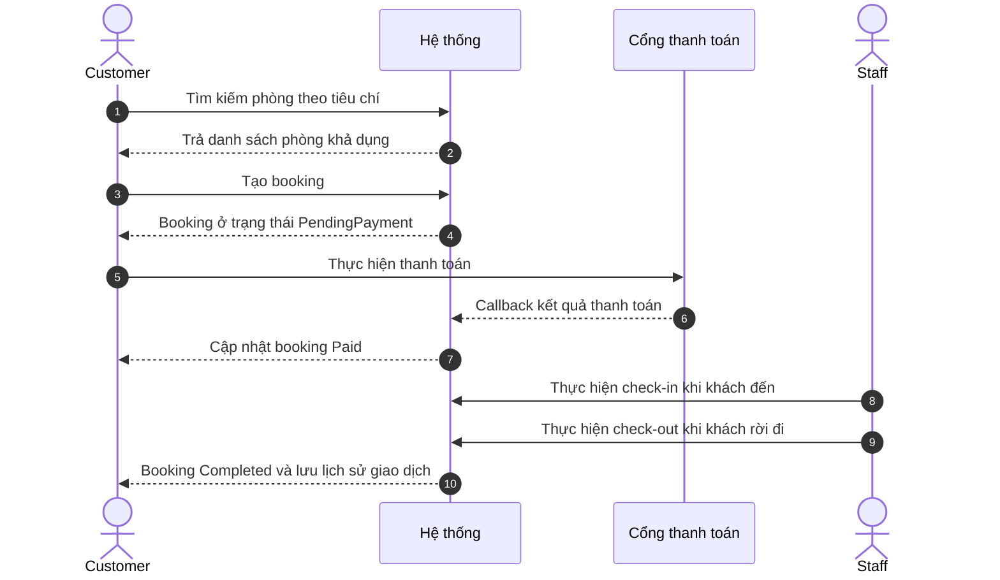
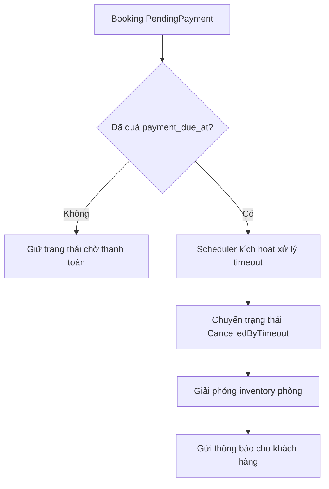

# CHƯƠNG 1: TÁC NHÂN VÀ BIỂU ĐỒ USECASE TỔNG QUÁT

## Trang ký hiệu và chữ viết tắt

Bảng dưới đây liệt kê các ký hiệu, thuật ngữ viết tắt được sử dụng xuyên suốt báo cáo, sắp xếp theo thứ tự chữ cái để thuận tiện tra cứu.

| STT | Ký hiệu/Viết tắt | Thuật ngữ đầy đủ | Diễn giải ngắn gọn trong ngữ cảnh hệ thống |
| --- | --- | --- | --- |
| 1 | ACID | Atomicity, Consistency, Isolation, Durability | Nhóm thuộc tính đảm bảo tính toàn vẹn và độ tin cậy của giao dịch dữ liệu. |
| 2 | API | Application Programming Interface | Giao diện lập trình ứng dụng dùng để giao tiếp giữa các thành phần hệ thống. |
| 3 | CI/CD | Continuous Integration / Continuous Deployment | Quy trình tích hợp, kiểm tra và triển khai liên tục nhằm tăng chất lượng phát hành. |
| 4 | CSS | Cascading Style Sheets | Ngôn ngữ định kiểu giao diện hiển thị cho các trang web. |
| 5 | DTO | Data Transfer Object | Cấu trúc dữ liệu trung gian dùng để trao đổi dữ liệu giữa các lớp và dịch vụ. |
| 6 | ERD | Entity Relationship Diagram | Sơ đồ mô tả thực thể dữ liệu và mối quan hệ giữa các thực thể. |
| 7 | FCP | First Contentful Paint | Chỉ số hiệu năng phản ánh thời điểm nội dung đầu tiên hiển thị cho người dùng. |
| 8 | HTML | HyperText Markup Language | Ngôn ngữ đánh dấu dùng để cấu trúc nội dung trang web. |
| 9 | HTTPS | HyperText Transfer Protocol Secure | Giao thức truyền tải bảo mật giữa máy khách và máy chủ. |
| 10 | IPN | Instant Payment Notification | Cơ chế thông báo kết quả thanh toán bất đồng bộ từ cổng thanh toán về hệ thống. |
| 11 | JWT | JSON Web Token | Chuẩn định dạng mã thông báo dùng cho xác thực và phân quyền truy cập. |
| 12 | ORM | Object Relational Mapping | Kỹ thuật ánh xạ giữa mô hình đối tượng và cơ sở dữ liệu quan hệ. |
| 13 | RBAC | Role-Based Access Control | Mô hình kiểm soát truy cập dựa trên vai trò người dùng. |
| 14 | REST | Representational State Transfer | Phong cách kiến trúc thiết kế dịch vụ web theo tài nguyên và phương thức HTTP. |
| 15 | SEO | Search Engine Optimization | Tập kỹ thuật tối ưu nội dung để tăng khả năng hiển thị trên công cụ tìm kiếm. |
| 16 | SPA | Single Page Application | Mô hình ứng dụng web tải một trang chính và cập nhật nội dung động. |
| 17 | SQL | Structured Query Language | Ngôn ngữ truy vấn và thao tác dữ liệu trên hệ quản trị cơ sở dữ liệu quan hệ. |
| 18 | SSR | Server-Side Rendering | Cơ chế dựng giao diện phía máy chủ trước khi gửi tới trình duyệt. |
| 19 | SSG | Static Site Generation | Cơ chế sinh trước trang tĩnh trong giai đoạn xây dựng để tăng tốc độ truy cập. |
| 20 | TLS | Transport Layer Security | Chuẩn bảo mật mã hóa dữ liệu trên đường truyền mạng. |
| 21 | UI/UX | User Interface / User Experience | Giao diện người dùng và trải nghiệm người dùng của hệ thống. |
| 22 | UML | Unified Modeling Language | Ngôn ngữ mô hình hóa chuẩn dùng để đặc tả thiết kế hệ thống. |
| 23 | UUID | Universally Unique Identifier | Định danh duy nhất toàn cục cho thực thể dữ liệu. |
| 24 | VNPAY | Vietnam Payment | Cổng thanh toán trực tuyến tích hợp trong quy trình thanh toán booking. |
| 25 | WSS | WebSocket Secure | Kênh giao tiếp WebSocket có mã hóa bảo mật, phục vụ cập nhật thời gian thực. |

## 1.1. Giới thiệu chương

Trong quá trình phân tích và thiết kế hệ thống đặt phòng khách sạn trực tuyến, việc xác định đúng tác nhân và phạm vi tương tác nghiệp vụ là bước nền tảng để bảo đảm tính đầy đủ của yêu cầu, tính nhất quán của luồng xử lý và khả năng mở rộng hệ thống về sau. Chương này tập trung mô tả toàn cảnh các đối tượng tương tác với hệ thống, các mục tiêu nghiệp vụ của từng tác nhân, cùng tập use case tổng quát làm khung tham chiếu cho các chương đặc tả chi tiết tiếp theo.

Nội dung chương được xây dựng theo hướng vừa phản ánh yêu cầu chức năng cốt lõi (đặt phòng, thanh toán, vận hành, quản trị), vừa thể hiện các điểm kiểm soát nghiệp vụ trọng yếu như chống đặt trùng, kiểm soát trạng thái đặt phòng - phòng lưu trú, phân quyền theo vai trò và tự động hóa xử lý tác vụ nền. Trên cơ sở đó, chương này đóng vai trò cầu nối giữa yêu cầu nghiệp vụ và mô hình thiết kế hệ thống.

## 1.2. Danh sách tác nhân (Actors)

### 1.2.1. Nguyên tắc nhận diện tác nhân

Tác nhân được nhận diện dựa trên ba tiêu chí chính: (1) có mục tiêu nghiệp vụ độc lập khi tương tác với hệ thống; (2) tạo hoặc tiếp nhận thông tin làm thay đổi trạng thái nghiệp vụ; (3) có quyền hạn và phạm vi thao tác khác biệt so với tác nhân khác. Theo cách tiếp cận này, hệ thống gồm cả tác nhân con người và tác nhân hệ thống bên ngoài/tự động.

### 1.2.2. Bảng danh sách tác nhân

*Bảng 1.1: Danh sách tác nhân và vai trò trong hệ thống đặt phòng khách sạn trực tuyến.*

| STT | Tác nhân | Đối tượng đại diện | Vai trò nghiệp vụ chính | Mức độ tương tác |
| --- | --- | --- | --- | --- |
| 1 | Guest | Người dùng chưa đăng nhập | Tìm kiếm phòng, xem thông tin phòng và chính sách, khởi tạo đăng ký/đăng nhập | Trung bình |
| 2 | Customer | Khách hàng đã xác thực | Tạo booking, thanh toán, theo dõi lịch sử booking, hủy booking theo chính sách, đánh giá dịch vụ | Rất cao |
| 3 | Staff/Receptionist | Nhân viên lễ tân/vận hành tiền sảnh | Xác minh booking, thực hiện check-in/check-out, xử lý phát sinh trong quá trình lưu trú | Cao |
| 4 | Housekeeping | Nhân viên buồng phòng | Cập nhật trạng thái vệ sinh/phòng sẵn sàng, phối hợp vận hành vòng đời phòng | Cao |
| 5 | Admin | Quản trị viên hệ thống | Quản trị danh mục phòng, quy tắc giá, phân quyền tài khoản, báo cáo vận hành - kinh doanh | Cao |
| 6 | Payment Gateway | Cổng thanh toán trực tuyến | Tiếp nhận giao dịch, phản hồi kết quả thanh toán qua callback/IPN, hỗ trợ đối soát giao dịch | Rất cao |
| 7 | System Scheduler | Tác vụ nền tự động | Quét booking quá hạn thanh toán, tự động hủy, giải phóng inventory và phát thông báo | Trung bình |

### 1.2.3. Phân tích chi tiết theo nhóm tác nhân

#### 1.2.3.1. Nhóm tác nhân khách hàng (Guest/Customer)

Nhóm tác nhân khách hàng quyết định trực tiếp doanh thu và tỷ lệ chuyển đổi của hệ thống. Guest đóng vai trò khởi tạo nhu cầu thông qua hành vi tra cứu phòng khả dụng, trong khi Customer thực hiện chuỗi giao dịch hoàn chỉnh từ đặt phòng đến thanh toán và hậu mãi. Điểm then chốt trong thiết kế nghiệp vụ cho nhóm này là giảm ma sát thao tác, bảo đảm minh bạch thông tin giá và tăng độ tin cậy trong trạng thái giao dịch.

#### 1.2.3.2. Nhóm tác nhân vận hành nội bộ (Staff/Housekeeping)

Đây là nhóm duy trì tính liên tục trong khai thác phòng thực tế. Staff gắn với các nghiệp vụ tại quầy lễ tân như check-in/check-out và xác nhận thông tin lưu trú; Housekeeping cập nhật trạng thái phòng theo tiến trình dọn dẹp. Mức độ chính xác của nhóm này ảnh hưởng trực tiếp đến dữ liệu khả dụng phòng trên kênh đặt trực tuyến, do đó yêu cầu đồng bộ trạng thái gần thời gian thực là yếu tố bắt buộc.

#### 1.2.3.3. Nhóm tác nhân quản trị (Admin)

Admin chịu trách nhiệm thiết lập “khung vận hành” của hệ thống thông qua quản trị inventory, chính sách giá theo mùa/sự kiện, tổ chức quyền truy cập và theo dõi chỉ số vận hành. Vai trò này không tham gia trực tiếp vào từng giao dịch đơn lẻ, nhưng quyết định chất lượng dữ liệu nền và hiệu quả kiểm soát rủi ro toàn hệ thống.

#### 1.2.3.4. Nhóm tác nhân tích hợp và tự động (Payment Gateway/System Scheduler)

Payment Gateway và System Scheduler tạo thành lớp xử lý hậu trường giúp hoàn tất vòng đời nghiệp vụ. Cổng thanh toán đảm bảo quá trình thu tiền và trả kết quả giao dịch có kiểm chứng; Scheduler bảo đảm các trường hợp ngoại lệ theo thời gian (quá hạn thanh toán) được xử lý tự động, nhất quán và không phụ thuộc thao tác thủ công.

*Hình 1.1: Phân nhóm tác nhân theo chức năng nghiệp vụ gồm nhóm khách hàng, nhóm vận hành nội bộ, nhóm quản trị và nhóm tích hợp/tự động.*

## 1.3. Biểu đồ Usecase tổng quát

### 1.3.1. Danh mục use case tổng hợp

*Bảng 1.2: Danh mục use case tổng quát theo tác nhân chính.*

| Mã use case | Tên use case | Tác nhân chính | Mục tiêu nghiệp vụ |
| --- | --- | --- | --- |
| UC-01 | Đăng ký tài khoản | Guest | Tạo tài khoản hợp lệ để sử dụng dịch vụ đặt phòng |
| UC-02 | Đăng nhập | Guest/Customer/Staff/Admin | Xác thực danh tính và cấp quyền truy cập theo vai trò |
| UC-03 | Tìm kiếm và lọc phòng | Guest/Customer | Tra cứu phòng khả dụng theo ngày ở, số khách, tiện nghi |
| UC-04 | Tạo booking | Customer | Tạo đơn đặt phòng và giữ chỗ tạm thời trước thanh toán |
| UC-05 | Thanh toán booking | Customer + Payment Gateway | Ghi nhận thanh toán thành công và cập nhật trạng thái booking |
| UC-06 | Xem lịch sử và chi tiết booking | Customer | Theo dõi trạng thái giao dịch và thông tin lưu trú |
| UC-07 | Hủy booking | Customer/Admin | Hủy đơn theo chính sách và xử lý hoàn/giải phóng tài nguyên |
| UC-08 | Check-in | Staff | Xác nhận khách nhận phòng đúng điều kiện nghiệp vụ |
| UC-09 | Check-out | Staff | Hoàn tất lưu trú, chốt chi phí và chuyển trạng thái phòng |
| UC-10 | Cập nhật trạng thái phòng | Staff/Housekeeping | Đồng bộ trạng thái phòng thực tế với hệ thống |
| UC-11 | Quản lý inventory và giá phòng | Admin | Tối ưu khả dụng phòng và cấu hình chính sách giá |
| UC-12 | Xem báo cáo vận hành | Admin | Phân tích doanh thu, công suất phòng, hiệu quả khai thác |

### 1.3.2. Biểu đồ use case tổng quát (Mermaid)

*Hình 1.2: Biểu đồ use case tổng quát thể hiện toàn bộ tương tác giữa các tác nhân với các nghiệp vụ cốt lõi của hệ thống.*

### 1.3.3. Phân rã use case theo miền chức năng

Để quản trị độ phức tạp và thuận lợi cho đặc tả chi tiết ở các chương sau, các use case được nhóm theo bốn miền chức năng chính:

- Miền **khám phá và chuyển đổi**: UC-01, UC-02, UC-03; tập trung vào tiếp cận dịch vụ và tạo điều kiện phát sinh giao dịch.
- Miền **giao dịch đặt phòng**: UC-04, UC-05, UC-06, UC-07; là chuỗi nghiệp vụ tác động trực tiếp đến doanh thu và trạng thái đặt phòng.
- Miền **vận hành lưu trú**: UC-08, UC-09, UC-10; đảm bảo đồng bộ giữa dữ liệu hệ thống và hoạt động thực địa tại khách sạn.
- Miền **quản trị và kiểm soát**: UC-11, UC-12 kết hợp tác vụ nền tự động; hỗ trợ điều hành, tối ưu nguồn lực và ra quyết định.

## 1.4. Quy trình nghiệp vụ tổng quát

### 1.4.1. Luồng xử lý từ tìm phòng đến hoàn tất lưu trú

*Hình 1.3: Luồng nghiệp vụ cốt lõi từ khám phá phòng, tạo booking, thanh toán đến hoàn tất lưu trú.*

### 1.4.2. Luồng xử lý ngoại lệ quá hạn thanh toán

Mô hình ngoại lệ trên bảo đảm hai mục tiêu đồng thời: (1) không để tài nguyên phòng bị giữ vô hạn gây thất thoát cơ hội bán; (2) duy trì tính nhất quán trạng thái dữ liệu trong toàn hệ thống mà không phụ thuộc thao tác thủ công.

## 1.5. Phân tích nghiệp vụ và chức năng ở mức chương

### 1.5.1. Nhóm nghiệp vụ doanh thu và chuyển đổi

Chuỗi UC-03 -> UC-04 -> UC-05 là trục doanh thu chính của hệ thống. Về mặt phân tích nghiệp vụ, chất lượng của chuỗi này phụ thuộc vào ba yếu tố: tính chính xác dữ liệu khả dụng phòng tại thời điểm tra cứu, cơ chế tái kiểm tra khi xác nhận đặt, và khả năng xử lý thanh toán an toàn - nhất quán. Mọi sai lệch trong chuỗi sẽ dẫn đến rủi ro mất đơn, tranh chấp hoặc sai báo cáo tài chính.

### 1.5.2. Nhóm nghiệp vụ vận hành lưu trú

Các use case UC-08, UC-09 và UC-10 thể hiện đặc thù vận hành khách sạn: cùng một đối tượng phòng phải chuyển qua nhiều trạng thái theo thời gian thực tế. Vì vậy, hệ thống cần bảo đảm quy tắc chuyển trạng thái hợp lệ, ví dụ phòng không thể chuyển trực tiếp từ `Dirty` sang `Occupied` nếu chưa được xác nhận dọn dẹp xong. Đây là cơ sở để giảm xung đột giữa bộ phận lễ tân và buồng phòng.

### 1.5.3. Nhóm nghiệp vụ quản trị và kiểm soát

UC-11 và UC-12 đóng vai trò kiểm soát chính sách và giám sát hiệu quả khai thác. Bản chất của nhóm này là quản trị “tham số hệ thống” (giá, tồn phòng, quyền truy cập) và “dữ liệu tổng hợp” (doanh thu, công suất phòng). Tính đúng đắn của các quyết định quản trị phụ thuộc trực tiếp vào độ tin cậy của dữ liệu giao dịch phát sinh ở các nhóm nghiệp vụ trước.

### 1.5.4. Ma trận liên kết tác nhân - chức năng

*Bảng 1.3: Ma trận liên kết giữa tác nhân và nhóm chức năng nghiệp vụ.*

| Tác nhân | Khám phá dịch vụ | Giao dịch booking | Vận hành lưu trú | Quản trị hệ thống | Tự động hóa/tích hợp |
| --- | --- | --- | --- | --- | --- |
| Guest | Có | Không | Không | Không | Không |
| Customer | Có | Có | Không | Không | Nhận kết quả tích hợp |
| Staff/Receptionist | Không | Hỗ trợ xử lý | Có | Không | Không |
| Housekeeping | Không | Không | Có | Không | Không |
| Admin | Không | Có (quản trị ngoại lệ) | Có (giám sát) | Có | Có (giám sát chính sách) |
| Payment Gateway | Không | Có | Không | Không | Có |
| System Scheduler | Không | Có | Không | Không | Có |

## 1.6. Kết luận chương

Chương 1 đã xác định đầy đủ các tác nhân tham gia hệ thống, mô tả vai trò nghiệp vụ của từng tác nhân và xây dựng biểu đồ use case tổng quát làm khung nhìn toàn cục cho bài toán đặt phòng khách sạn trực tuyến. Việc phân nhóm use case theo miền chức năng, kết hợp phân tích luồng chính và luồng ngoại lệ, cho thấy hệ thống không chỉ tập trung vào khả năng đặt phòng mà còn chú trọng kiểm soát trạng thái, vận hành thực địa và quản trị dữ liệu.

Kết quả của chương là nền tảng trực tiếp để triển khai đặc tả use case chi tiết, xây dựng biểu đồ tương tác và thiết kế dữ liệu ở các chương sau, bảo đảm toàn bộ quá trình phân tích - thiết kế được liên kết chặt chẽ, logic và nhất quán với mục tiêu vận hành thực tế của hệ thống.
