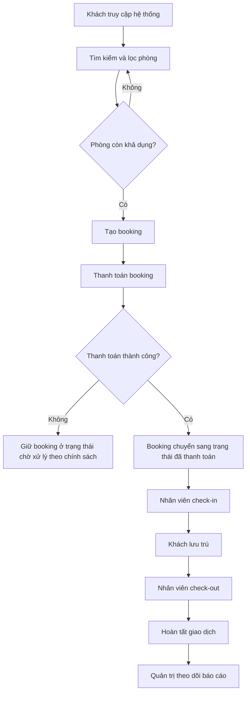
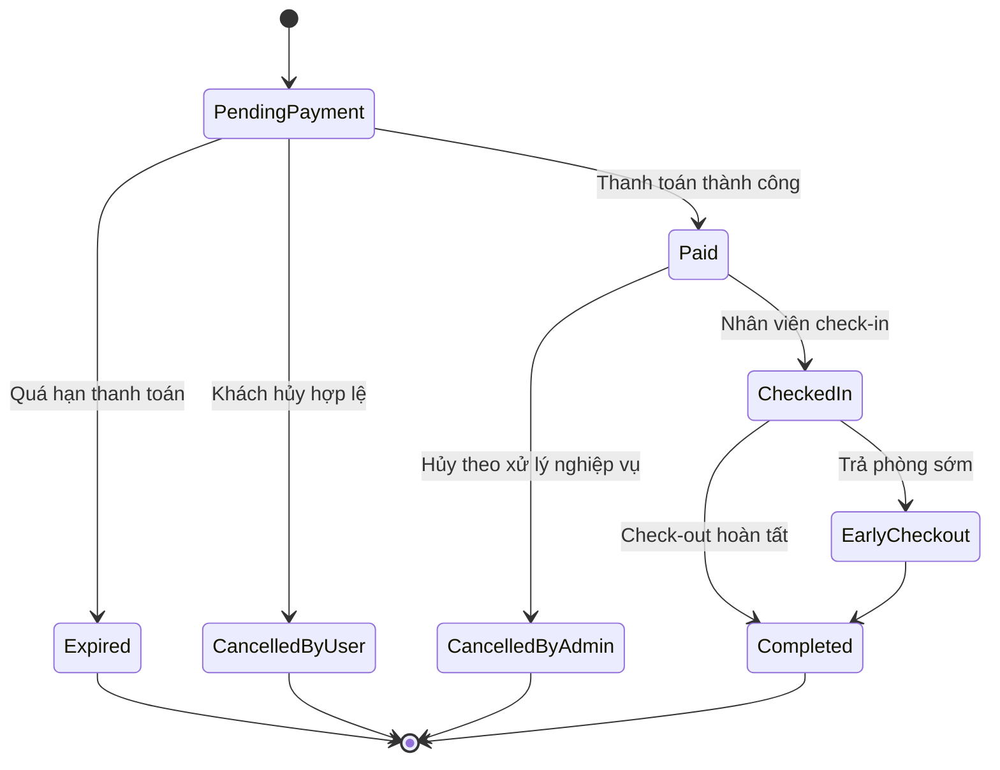

# CHƯƠNG 2: MÔ TẢ VÀ ĐẶC TẢ USECASE CHI TIẾT

## 2.1. Giới thiệu chương

Chương 2 tập trung đặc tả chi tiết các use case trọng yếu của hệ thống đặt phòng khách sạn trực tuyến, đóng vai trò cầu nối giữa mô hình nghiệp vụ tổng quát và thiết kế tương tác ở các chương tiếp theo. Nếu Chương 1 xác định phạm vi chức năng thông qua tác nhân và biểu đồ use case tổng quát, thì chương này đi sâu vào nội dung vận hành của từng chức năng: điều kiện thực thi, quy tắc nghiệp vụ, luồng xử lý chính, luồng ngoại lệ và kết quả sau cùng.

Mục tiêu của chương gồm ba nội dung chính. Thứ nhất, chuẩn hóa cách hiểu nghiệp vụ giữa các bên liên quan thông qua cấu trúc đặc tả thống nhất. Thứ hai, xác lập cơ sở kiểm thử chức năng dựa trên các kịch bản luồng chính và nhánh ngoại lệ. Thứ ba, bảo đảm tính nhất quán xuyên suốt giữa yêu cầu người dùng, quy trình vận hành khách sạn và mô hình dữ liệu giao dịch.

Trong phạm vi hệ thống, các use case được tổ chức theo bốn nhóm nghiệp vụ cốt lõi: (1) nhóm khách hàng và tra cứu phòng; (2) nhóm đặt phòng và thanh toán; (3) nhóm vận hành lưu trú; (4) nhóm quản trị hệ thống. Cách phân nhóm này giúp định vị rõ trách nhiệm của từng tác nhân, đồng thời hỗ trợ mở rộng hệ thống theo từng phân hệ mà không phá vỡ cấu trúc tổng thể.

*Hình 2.1: Sơ đồ tổng quan phạm vi đặc tả use case chi tiết.*

## 2.2. Bảng danh mục Usecase

### 2.2.1. Nguyên tắc lập danh mục

Danh mục use case được xây dựng theo các nguyên tắc: phản ánh đầy đủ hành trình nghiệp vụ từ tìm kiếm phòng đến hoàn tất lưu trú; ưu tiên các tác vụ có ảnh hưởng trực tiếp đến doanh thu và trải nghiệm khách hàng; đồng thời bao phủ các chức năng kiểm soát vận hành dành cho nhân viên và quản trị viên.

Mỗi use case được gán mã định danh duy nhất theo chuẩn `UC-xx` để thuận tiện liên kết chéo giữa các chương và phục vụ truy vết trong quá trình kiểm thử, bảo trì hệ thống.

### 2.2.2. Danh mục use case theo tác nhân

Bảng 2.1: Danh mục use case toàn hệ thống

| Mã use case | Tên use case | Tác nhân chính | Nhóm nghiệp vụ | Mô tả ngắn gọn | Mức ưu tiên |
| --- | --- | --- | --- | --- | --- |
| UC-01 | Đăng ký tài khoản | Guest | Khách hàng | Khách tạo tài khoản mới để sử dụng dịch vụ đặt phòng | Cao |
| UC-02 | Đăng nhập hệ thống | Customer/Admin/Staff | Khách hàng - Quản trị | Người dùng xác thực để truy cập chức năng theo vai trò | Rất cao |
| UC-03 | Tìm kiếm và lọc phòng | Guest/Customer | Tra cứu phòng | Tìm phòng khả dụng theo ngày ở, số khách, mức giá, tiện nghi | Rất cao |
| UC-04 | Tạo booking | Customer | Đặt phòng | Khách xác nhận thông tin đặt phòng và tạo booking chờ thanh toán | Rất cao |
| UC-05 | Thanh toán booking | Customer + Cổng thanh toán | Thanh toán | Khách thanh toán trực tuyến, hệ thống ghi nhận kết quả giao dịch | Rất cao |
| UC-06 | Xem lịch sử và chi tiết booking | Customer | Hậu giao dịch | Khách theo dõi trạng thái và thông tin các booking đã tạo | Trung bình |
| UC-07 | Hủy booking | Customer/Admin | Hậu giao dịch | Thực hiện hủy đặt phòng theo điều kiện chính sách | Cao |
| UC-08 | Check-in | Staff | Vận hành lưu trú | Nhân viên xác nhận nhận phòng cho booking hợp lệ | Rất cao |
| UC-09 | Check-out | Staff | Vận hành lưu trú | Nhân viên hoàn tất trả phòng, chốt công nợ và trạng thái | Rất cao |
| UC-10 | Cập nhật trạng thái phòng | Staff/Housekeeping | Vận hành phòng | Cập nhật vòng đời phòng theo tình trạng khai thác thực tế | Cao |
| UC-11 | Quản lý inventory và giá phòng | Admin | Quản trị kinh doanh | Quản trị viên thiết lập giá, số lượng và chính sách tồn phòng | Cao |
| UC-12 | Xem báo cáo vận hành | Admin | Phân tích - Điều hành | Theo dõi doanh thu, công suất phòng và hiệu quả kinh doanh | Trung bình |

### 2.2.3. Sơ đồ luồng nghiệp vụ tổng hợp

*Hình 2.2: Luồng nghiệp vụ tổng hợp từ tìm kiếm đến hoàn tất lưu trú.*

## 2.3. Đặc tả Usecase chi tiết

### 2.3.1. Quy ước đặc tả

Các use case được đặc tả theo cấu trúc thống nhất gồm: tên use case, tác nhân chính, mô tả ngắn, điều kiện tiên quyết, điều kiện kết thúc, luồng sự kiện chính và luồng sự kiện phụ. Quy ước này giúp giảm sai lệch khi chuyển đổi từ nghiệp vụ sang thiết kế và kiểm thử.

### 2.3.2. UC-03 - Tìm kiếm và lọc phòng

Bảng 2.2: Đặc tả use case UC-03

| Thành phần | Nội dung |
| --- | --- |
| Tên Usecase | UC-03 - Tìm kiếm và lọc phòng |
| Tác nhân chính | Guest/Customer |
| Mô tả ngắn | Người dùng tra cứu danh sách phòng khả dụng theo tiêu chí thời gian và nhu cầu lưu trú. |
| Điều kiện tiên quyết | Hệ thống đang hoạt động; dữ liệu phòng và lịch khả dụng đã được thiết lập. |
| Điều kiện kết thúc thành công | Trả về danh sách phòng phù hợp cùng giá hiển thị và thông tin tiện nghi. |
| Điều kiện kết thúc thất bại | Trả về thông báo lỗi dữ liệu đầu vào hoặc không tìm thấy phòng phù hợp. |
| Luồng sự kiện chính | 1) Người dùng nhập ngày nhận phòng, ngày trả phòng, số khách và bộ lọc. 2) Hệ thống kiểm tra tính hợp lệ dữ liệu. 3) Hệ thống truy vấn phòng khả dụng theo khoảng ngày. 4) Hệ thống áp dụng bộ lọc giá/loại phòng/tiện nghi. 5) Hệ thống hiển thị danh sách kết quả và thông tin giá tham chiếu. |
| Luồng sự kiện phụ | A1) Ngày nhận lớn hơn hoặc bằng ngày trả: từ chối truy vấn và yêu cầu nhập lại. A2) Không có phòng khả dụng: hiển thị thông báo và gợi ý thay đổi tiêu chí. A3) Giá thay đổi theo thời điểm: hệ thống cảnh báo giá có thể cập nhật tại bước xác nhận đặt phòng. |

### 2.3.3. UC-04 - Tạo booking

Bảng 2.3: Đặc tả use case UC-04

| Thành phần | Nội dung |
| --- | --- |
| Tên Usecase | UC-04 - Tạo booking |
| Tác nhân chính | Customer |
| Mô tả ngắn | Khách hàng xác nhận lựa chọn phòng và thông tin lưu trú để tạo booking ở trạng thái chờ thanh toán. |
| Điều kiện tiên quyết | Khách đã đăng nhập; đã chọn phòng từ kết quả tìm kiếm; phòng còn khả dụng tại thời điểm gửi yêu cầu. |
| Điều kiện kết thúc thành công | Booking được tạo với mã đặt phòng, tổng tiền tạm tính và hạn thanh toán. |
| Điều kiện kết thúc thất bại | Booking không được tạo do xung đột khả dụng, dữ liệu không hợp lệ hoặc vượt chính sách. |
| Luồng sự kiện chính | 1) Khách điền thông tin người lưu trú và yêu cầu bổ sung. 2) Hệ thống tái kiểm tra khả dụng theo thời gian thực. 3) Hệ thống tính tổng chi phí theo chính sách giá hiện hành. 4) Khách xác nhận tạo booking. 5) Hệ thống sinh mã booking và đặt trạng thái `PendingPayment`. 6) Hệ thống trả thông tin chuyển sang bước thanh toán. |
| Luồng sự kiện phụ | A1) Phòng vừa hết chỗ: trả thông báo xung đột và yêu cầu chọn phòng khác. A2) Giá thay đổi so với thời điểm tra cứu: hiển thị mức giá mới để khách xác nhận lại. A3) Khách hủy thao tác trước khi xác nhận: hệ thống không tạo booking. |

### 2.3.4. UC-05 - Thanh toán booking

Bảng 2.4: Đặc tả use case UC-05

| Thành phần | Nội dung |
| --- | --- |
| Tên Usecase | UC-05 - Thanh toán booking |
| Tác nhân chính | Customer (phối hợp Cổng thanh toán) |
| Mô tả ngắn | Khách thực hiện thanh toán trực tuyến cho booking và hệ thống cập nhật trạng thái giao dịch. |
| Điều kiện tiên quyết | Booking hợp lệ ở trạng thái `PendingPayment` và chưa quá hạn thanh toán. |
| Điều kiện kết thúc thành công | Giao dịch được xác nhận thành công; booking chuyển trạng thái `Paid`; gửi thông báo xác nhận cho khách. |
| Điều kiện kết thúc thất bại | Giao dịch thất bại, bị hủy hoặc callback không hợp lệ; booking xử lý theo chính sách timeout/đối soát. |
| Luồng sự kiện chính | 1) Khách chọn phương thức thanh toán. 2) Hệ thống khởi tạo phiên giao dịch và chuyển hướng tới cổng thanh toán. 3) Khách hoàn tất thanh toán trên cổng. 4) Cổng thanh toán gửi kết quả về hệ thống. 5) Hệ thống xác thực tính hợp lệ của phản hồi giao dịch. 6) Hệ thống cập nhật trạng thái thanh toán và booking. 7) Hệ thống gửi thông báo kết quả cho khách. |
| Luồng sự kiện phụ | A1) Khách thoát giữa chừng: giao dịch ở trạng thái chưa hoàn tất, booking chờ tới hạn. A2) Callback gửi lặp: hệ thống xử lý idempotent, không cập nhật trùng. A3) Callback sai chữ ký: từ chối cập nhật và ghi nhận sự kiện an toàn. |

### 2.3.5. UC-07 - Hủy booking

Bảng 2.5: Đặc tả use case UC-07

| Thành phần | Nội dung |
| --- | --- |
| Tên Usecase | UC-07 - Hủy booking |
| Tác nhân chính | Customer/Admin |
| Mô tả ngắn | Người dùng có thẩm quyền thực hiện hủy booking theo điều kiện thời gian và trạng thái đơn. |
| Điều kiện tiên quyết | Booking tồn tại; tác nhân có quyền thao tác; booking chưa ở trạng thái không thể hủy. |
| Điều kiện kết thúc thành công | Booking chuyển trạng thái hủy hợp lệ; tài nguyên phòng được giải phóng; thông báo gửi tới bên liên quan. |
| Điều kiện kết thúc thất bại | Từ chối hủy do quá thời hạn, sai quyền hoặc trạng thái không cho phép. |
| Luồng sự kiện chính | 1) Tác nhân gửi yêu cầu hủy kèm lý do. 2) Hệ thống kiểm tra quyền thao tác và trạng thái booking. 3) Hệ thống đối chiếu chính sách hủy theo mốc thời gian. 4) Hệ thống cập nhật trạng thái hủy. 5) Hệ thống giải phóng inventory phòng liên quan. 6) Hệ thống thông báo kết quả hủy. |
| Luồng sự kiện phụ | A1) Booking đã check-in: từ chối hủy trực tuyến và hướng dẫn xử lý vận hành. A2) Booking đã hoàn tất: không cho phép hủy. A3) Yêu cầu hoàn tiền phát sinh: chuyển sang quy trình đối soát tài chính theo quy định. |

### 2.3.6. UC-08 - Check-in

Bảng 2.6: Đặc tả use case UC-08

| Thành phần | Nội dung |
| --- | --- |
| Tên Usecase | UC-08 - Check-in |
| Tác nhân chính | Staff |
| Mô tả ngắn | Nhân viên lễ tân xác nhận khách nhận phòng dựa trên booking hợp lệ và thông tin định danh. |
| Điều kiện tiên quyết | Booking ở trạng thái đã thanh toán hoặc đủ điều kiện nhận phòng; phòng sẵn sàng khai thác. |
| Điều kiện kết thúc thành công | Booking chuyển trạng thái `CheckedIn`; trạng thái phòng cập nhật `Occupied`. |
| Điều kiện kết thúc thất bại | Từ chối check-in do booking không hợp lệ, chưa thanh toán hoặc thông tin xác minh sai. |
| Luồng sự kiện chính | 1) Nhân viên nhập mã booking và thông tin xác minh khách. 2) Hệ thống kiểm tra tồn tại booking và điều kiện check-in. 3) Hệ thống xác nhận tình trạng sẵn sàng của phòng. 4) Nhân viên xác nhận thao tác nhận phòng. 5) Hệ thống cập nhật trạng thái booking và phòng. 6) Hệ thống ghi nhận thời điểm check-in thực tế. |
| Luồng sự kiện phụ | A1) Khách đến sớm trước giờ nhận phòng: xử lý theo chính sách phụ thu/đợi phòng. A2) Phòng chưa sẵn sàng: chuyển tình huống cho bộ phận buồng phòng. A3) Mã booking không tồn tại: từ chối thao tác và yêu cầu kiểm tra lại thông tin. |

### 2.3.7. UC-09 - Check-out

Bảng 2.7: Đặc tả use case UC-09

| Thành phần | Nội dung |
| --- | --- |
| Tên Usecase | UC-09 - Check-out |
| Tác nhân chính | Staff |
| Mô tả ngắn | Nhân viên hoàn tất trả phòng, chốt công nợ phát sinh và cập nhật trạng thái kết thúc lưu trú. |
| Điều kiện tiên quyết | Booking đang ở trạng thái `CheckedIn`; có dữ liệu dịch vụ phát sinh (nếu có). |
| Điều kiện kết thúc thành công | Booking chuyển trạng thái `Completed`; phòng chuyển trạng thái `Dirty` chờ dọn dẹp. |
| Điều kiện kết thúc thất bại | Chưa thể check-out do còn công nợ chưa xử lý hoặc thiếu xác nhận bắt buộc. |
| Luồng sự kiện chính | 1) Nhân viên truy xuất booking đang lưu trú. 2) Hệ thống tổng hợp tiền phòng và dịch vụ phát sinh. 3) Nhân viên xác nhận thông tin thanh toán cuối cùng. 4) Hệ thống cập nhật trạng thái hoàn tất lưu trú. 5) Hệ thống chuyển trạng thái phòng sang cần dọn dẹp. |
| Luồng sự kiện phụ | A1) Có khoản phát sinh chưa thanh toán: yêu cầu hoàn tất nghĩa vụ tài chính trước khi check-out. A2) Khách trả phòng muộn: tự động áp dụng phụ phí theo chính sách. A3) Sự cố kỹ thuật trong đối soát: tạm khóa thao tác và chuyển xử lý quản trị. |

### 2.3.8. UC-10 - Cập nhật trạng thái phòng

Bảng 2.8: Đặc tả use case UC-10

| Thành phần | Nội dung |
| --- | --- |
| Tên Usecase | UC-10 - Cập nhật trạng thái phòng |
| Tác nhân chính | Staff/Housekeeping |
| Mô tả ngắn | Cập nhật vòng đời vận hành phòng theo trạng thái thực tế để bảo đảm chính xác khả dụng bán phòng. |
| Điều kiện tiên quyết | Người thao tác có quyền phù hợp; phòng tồn tại trong hệ thống. |
| Điều kiện kết thúc thành công | Trạng thái phòng được cập nhật hợp lệ và đồng bộ tới các màn hình vận hành. |
| Điều kiện kết thúc thất bại | Từ chối cập nhật do chuyển trạng thái không hợp lệ hoặc xung đột với booking hiện hành. |
| Luồng sự kiện chính | 1) Nhân viên chọn phòng cần cập nhật. 2) Hệ thống kiểm tra trạng thái hiện tại. 3) Nhân viên chọn trạng thái đích theo nghiệp vụ vận hành. 4) Hệ thống kiểm tra tính hợp lệ của phép chuyển trạng thái. 5) Hệ thống ghi nhận trạng thái mới và thời điểm cập nhật. |
| Luồng sự kiện phụ | A1) Cập nhật từ `Occupied` sang `Available` trực tiếp: từ chối do vi phạm quy trình vận hành. A2) Phòng đang bảo trì: không cho phép tạo booking mới. A3) Mất kết nối tạm thời: hệ thống lưu hàng đợi đồng bộ và thông báo lại khi hoàn tất. |

### 2.3.9. UC-11 - Quản lý inventory và giá phòng

Bảng 2.9: Đặc tả use case UC-11

| Thành phần | Nội dung |
| --- | --- |
| Tên Usecase | UC-11 - Quản lý inventory và giá phòng |
| Tác nhân chính | Admin |
| Mô tả ngắn | Quản trị viên thiết lập số lượng phòng khai thác và chính sách giá theo thời gian, hạng phòng hoặc mùa vụ. |
| Điều kiện tiên quyết | Quản trị viên đã xác thực và có quyền cấu hình kinh doanh. |
| Điều kiện kết thúc thành công | Cấu hình inventory/giá mới có hiệu lực theo mốc thời gian thiết lập. |
| Điều kiện kết thúc thất bại | Từ chối lưu cấu hình do dữ liệu xung đột, trùng khoảng hiệu lực hoặc vi phạm quy tắc giá. |
| Luồng sự kiện chính | 1) Quản trị viên chọn hạng phòng và kỳ hiệu lực. 2) Nhập số lượng khai thác và mức giá. 3) Hệ thống kiểm tra xung đột kỳ hiệu lực. 4) Hệ thống lưu cấu hình mới và đánh dấu phiên bản hiệu lực. 5) Hệ thống áp dụng cho các truy vấn tìm kiếm và đặt phòng tiếp theo. |
| Luồng sự kiện phụ | A1) Kỳ hiệu lực chồng lấn: yêu cầu điều chỉnh phạm vi ngày. A2) Giảm tồn dưới mức đã cam kết theo booking: từ chối lưu. A3) Cấu hình giá bất thường vượt ngưỡng kiểm soát: yêu cầu xác nhận quản trị nâng cao. |

### 2.3.10. UC-12 - Xem báo cáo vận hành

Bảng 2.10: Đặc tả use case UC-12

| Thành phần | Nội dung |
| --- | --- |
| Tên Usecase | UC-12 - Xem báo cáo vận hành |
| Tác nhân chính | Admin |
| Mô tả ngắn | Quản trị viên theo dõi chỉ số doanh thu, công suất phòng và xu hướng đặt phòng theo thời gian. |
| Điều kiện tiên quyết | Có dữ liệu giao dịch trong kỳ; tài khoản có quyền truy cập báo cáo. |
| Điều kiện kết thúc thành công | Báo cáo hiển thị đầy đủ số liệu tổng hợp theo bộ lọc và phạm vi thời gian yêu cầu. |
| Điều kiện kết thúc thất bại | Không hiển thị báo cáo do thiếu quyền hoặc dữ liệu kỳ báo cáo không khả dụng. |
| Luồng sự kiện chính | 1) Quản trị viên chọn loại báo cáo và khoảng thời gian. 2) Hệ thống tổng hợp số liệu từ dữ liệu giao dịch. 3) Hệ thống tính toán các chỉ số chính. 4) Hệ thống hiển thị bảng và biểu đồ trực quan. |
| Luồng sự kiện phụ | A1) Dữ liệu kỳ báo cáo chưa hoàn tất đối soát: hiển thị trạng thái tạm tính. A2) Khoảng thời gian quá lớn: yêu cầu tinh gọn bộ lọc để tối ưu xử lý. A3) Quyền truy cập không đủ: từ chối và ghi nhật ký an toàn. |

## 2.4. Phân tích quy trình và quy tắc nghiệp vụ liên quan

### 2.4.1. Quy trình chuyển trạng thái booking

Để bảo đảm tính nhất quán nghiệp vụ, booking được quản lý theo vòng đời trạng thái có kiểm soát. Mỗi bước chuyển trạng thái chỉ được thực hiện khi thỏa điều kiện nghiệp vụ tương ứng, từ đó hạn chế sai lệch dữ liệu và hỗ trợ truy vết giao dịch.

*Hình 2.3: Vòng đời trạng thái booking trong hệ thống.*

### 2.4.2. Ma trận quy tắc nghiệp vụ trọng yếu

Bảng 2.11: Ma trận quy tắc nghiệp vụ áp dụng cho các use case chính

| Mã quy tắc | Nội dung quy tắc | Use case áp dụng | Mục tiêu kiểm soát |
| --- | --- | --- | --- |
| BR-01 | Ngày nhận phòng phải nhỏ hơn ngày trả phòng | UC-03, UC-04 | Bảo đảm tính hợp lệ dữ liệu thời gian |
| BR-02 | Mỗi booking phải tái kiểm tra khả dụng trước khi xác nhận | UC-04 | Ngăn chặn overbooking |
| BR-03 | Chỉ booking `PendingPayment` mới được phép thanh toán | UC-05 | Ngăn thanh toán sai trạng thái |
| BR-04 | Kết quả callback thanh toán phải qua kiểm tra chữ ký hợp lệ | UC-05 | An toàn giao dịch, chống giả mạo |
| BR-05 | Hủy booking phải tuân thủ chính sách thời gian và trạng thái | UC-07 | Bảo vệ quyền lợi hai bên |
| BR-06 | Check-in chỉ áp dụng cho booking đã đủ điều kiện nhận phòng | UC-08 | Kiểm soát vận hành lễ tân |
| BR-07 | Check-out yêu cầu hoàn tất nghĩa vụ tài chính | UC-09 | Tính chính xác doanh thu |
| BR-08 | Trạng thái phòng chỉ chuyển theo chuỗi hợp lệ | UC-10 | Duy trì dữ liệu khả dụng phòng |
| BR-09 | Cấu hình giá không được chồng lấn hiệu lực trên cùng phân khúc | UC-11 | Nhất quán chính sách giá |
| BR-10 | Báo cáo quản trị chỉ truy cập bởi vai trò được phân quyền | UC-12 | Bảo mật dữ liệu điều hành |

### 2.4.3. Truy vết liên kết giữa use case và giá trị nghiệp vụ

Phân tích truy vết cho thấy các use case không tồn tại độc lập mà tạo thành chuỗi giá trị liên tục. Nhóm UC-03 đến UC-05 tối ưu năng lực chuyển đổi từ truy cập sang thanh toán. Nhóm UC-08 đến UC-10 đảm bảo chất lượng vận hành tại điểm dịch vụ. Nhóm UC-11 và UC-12 cung cấp công cụ điều hành để tối ưu công suất phòng và hiệu quả kinh doanh theo thời gian.

Việc xây dựng đặc tả đầy đủ cho từng use case giúp giảm rủi ro mơ hồ yêu cầu, đồng thời tăng khả năng tái sử dụng khi mở rộng hệ thống sang mô hình nhiều cơ sở lưu trú hoặc tích hợp thêm kênh bán phòng trong tương lai.

## 2.5. Kết luận chương

Chương 2 đã hoàn thiện danh mục và đặc tả chi tiết các use case cốt lõi của hệ thống đặt phòng khách sạn trực tuyến theo một cấu trúc thống nhất, chặt chẽ và có khả năng kiểm chứng. Nội dung đặc tả đã làm rõ vai trò tác nhân, điều kiện nghiệp vụ, luồng chính và các tình huống ngoại lệ trọng yếu đối với từng chức năng.

Kết quả của chương tạo ra nền tảng quan trọng cho các hoạt động tiếp theo: xây dựng biểu đồ tuần tự chi tiết, thiết kế lớp và cơ sở dữ liệu, đồng thời hỗ trợ trực tiếp cho việc lập kịch bản kiểm thử chức năng. Việc chuẩn hóa use case ở mức chi tiết cũng góp phần bảo đảm tính nhất quán giữa yêu cầu nghiệp vụ, quy trình vận hành thực tế và mục tiêu chất lượng tổng thể của hệ thống.
