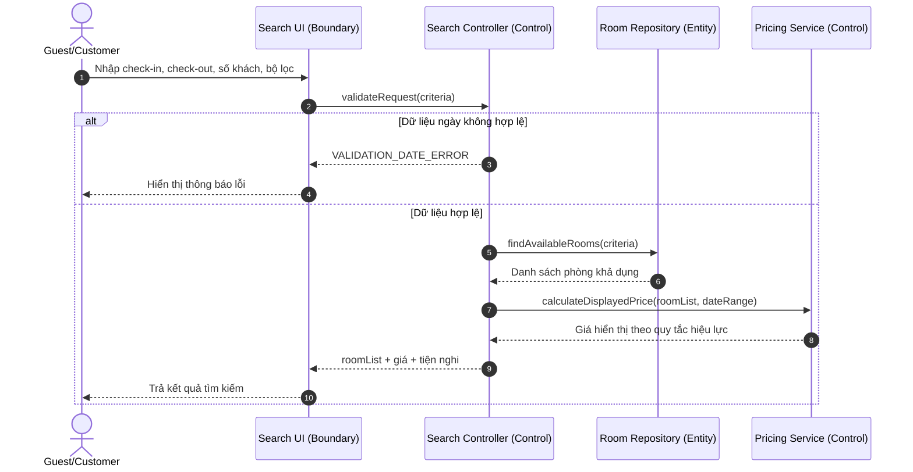
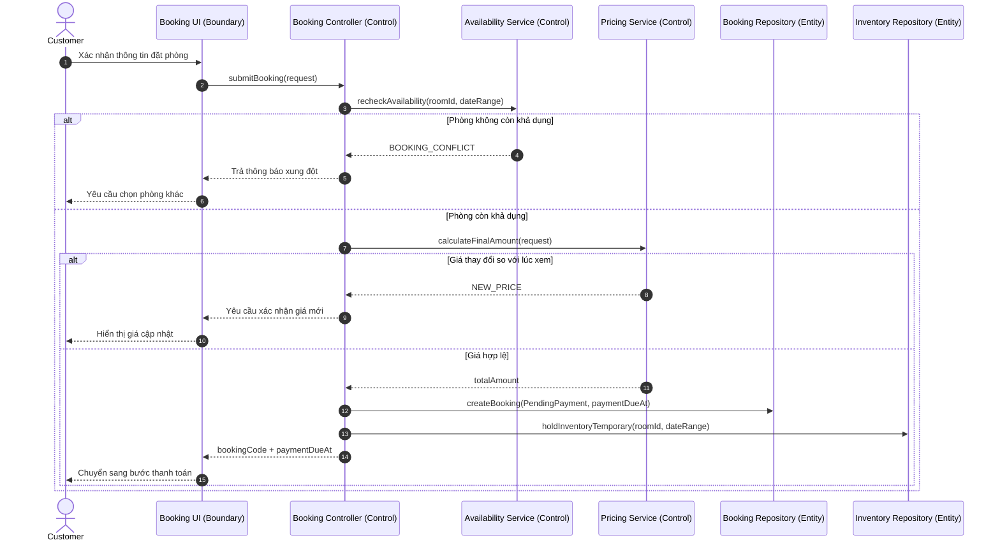
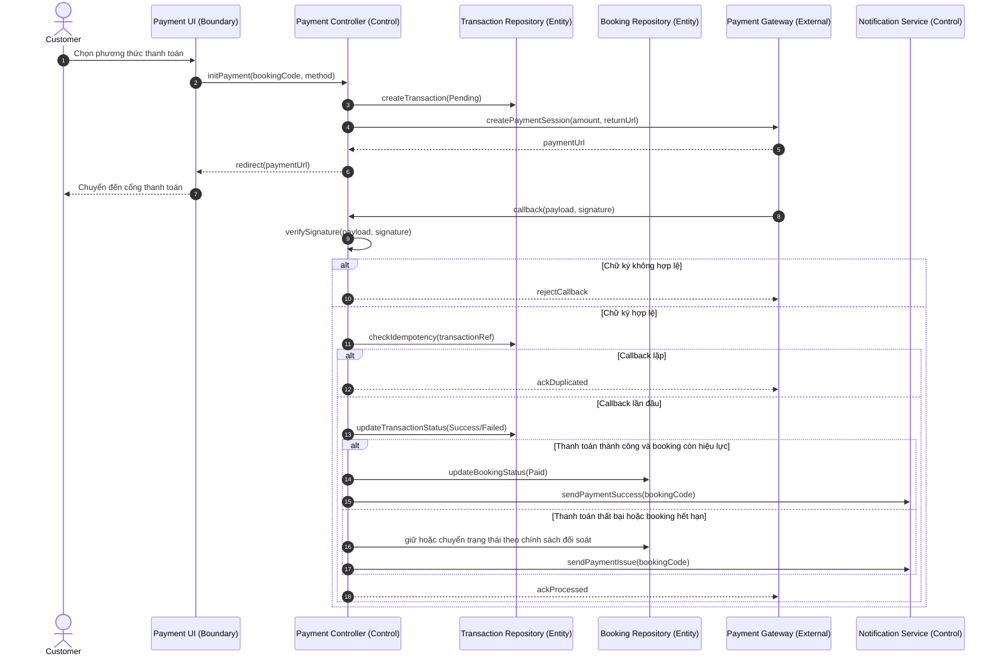
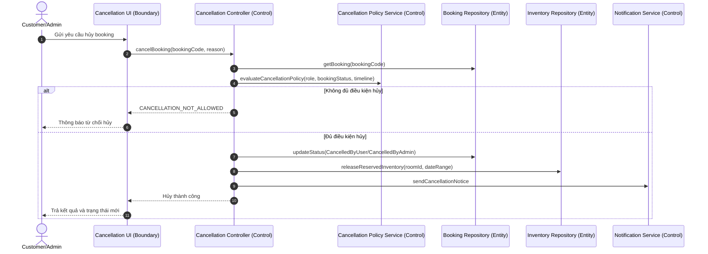
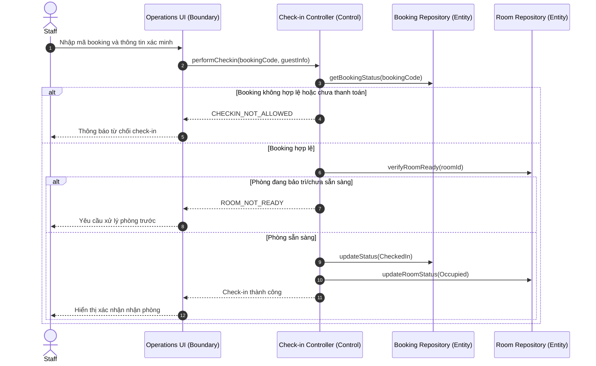
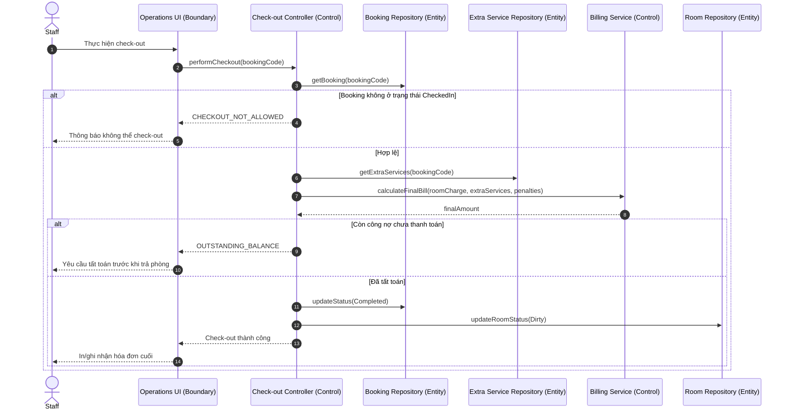
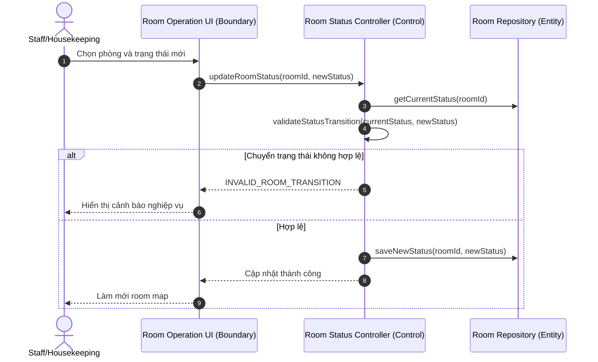
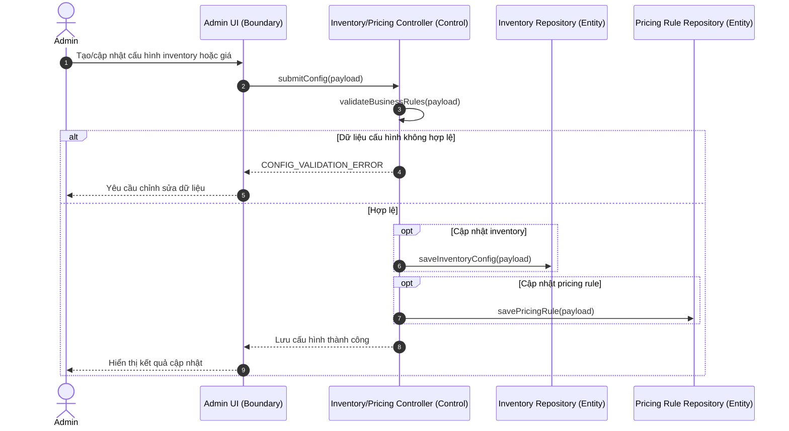
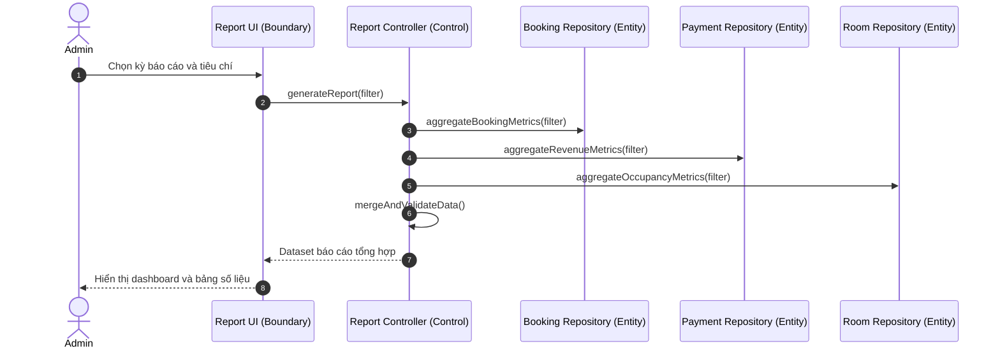
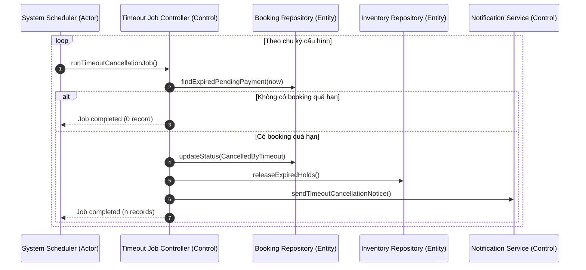

# CHƯƠNG 3: BIỂU ĐỒ TUẦN TỰ CHI TIẾT

## 3.1. Giới thiệu chương

Chương này trình bày biểu đồ tuần tự chi tiết cho các nghiệp vụ cốt lõi của hệ thống đặt phòng khách sạn trực tuyến. Mục tiêu là mô hình hóa rõ ràng trình tự tương tác giữa tác nhân bên ngoài và các thành phần nội bộ theo cách nhất quán với đặc tả use case đã xây dựng, từ đó làm cơ sở cho kiểm thử nghiệp vụ, kiểm soát trạng thái dữ liệu và đánh giá tính đúng đắn của luồng xử lý.

Trọng tâm của chương bao gồm: (1) xác định các lớp đối tượng tham gia tương tác theo mô hình Actor - Boundary - Control - Entity, (2) mô tả tuần tự thông điệp trong luồng chính và các luồng rẽ nhánh quan trọng, (3) phân tích các điểm kiểm soát nghiệp vụ nhằm bảo đảm tính toàn vẹn dữ liệu, tránh xung đột đặt phòng, và duy trì tính nhất quán trạng thái booking - phòng - giao dịch.

## 3.2. Nguyên tắc xây dựng biểu đồ tuần tự

### 3.2.1. Mục tiêu mô hình hóa

Biểu đồ tuần tự được xây dựng để đạt các mục tiêu sau:

- Mô tả đầy đủ thứ tự xử lý theo thời gian của từng use case.
- Làm rõ trách nhiệm của từng thành phần trong kiến trúc nghiệp vụ.
- Chuẩn hóa các nhánh điều kiện và ngoại lệ để giảm rủi ro hiểu sai yêu cầu.
- Hỗ trợ ánh xạ trực tiếp sang kịch bản kiểm thử chức năng và kiểm thử tích hợp.

### 3.2.2. Thành phần tham gia tương tác

Các biểu đồ trong chương thống nhất sử dụng các nhóm đối tượng sau:

Bảng 3.1: Thành phần tham gia tương tác trong biểu đồ tuần tự

| Nhóm đối tượng | Ký hiệu | Vai trò trong biểu đồ tuần tự |
| --- | --- | --- |
| Tác nhân ngoài hệ thống | Actor | Khởi tạo yêu cầu và nhận phản hồi nghiệp vụ |
| Lớp giao tiếp | Boundary | Tiếp nhận yêu cầu, phản hồi kết quả, chuẩn hóa giao tiếp |
| Lớp điều phối | Control | Thực thi quy tắc nghiệp vụ, điều phối luồng xử lý |
| Lớp dữ liệu | Entity | Lưu trữ, truy xuất và cập nhật trạng thái dữ liệu |
| Dịch vụ tích hợp | External Service | Cổng thanh toán, kênh thông báo hoặc dịch vụ liên thông |

### 3.2.3. Quy ước ký hiệu và nhánh điều kiện

- `->>` biểu diễn thông điệp gọi xử lý đồng bộ.
- Khối `alt` biểu diễn rẽ nhánh theo điều kiện nghiệp vụ.
- Khối `opt` biểu diễn nhánh tùy chọn.
- Khối `loop` biểu diễn xử lý lặp hoặc quét định kỳ.
- Điều kiện rẽ nhánh được ghi rõ để bám sát đặc tả use case và quy tắc nghiệp vụ.

### 3.2.4. Nguyên tắc nhất quán trạng thái

Để bảo đảm tính toàn vẹn trong toàn hệ thống, các biểu đồ đều tuân thủ các nguyên tắc:

- Trạng thái booking chỉ chuyển theo vòng đời hợp lệ: `PendingPayment -> Paid -> CheckedIn -> Completed` hoặc các nhánh hủy hợp lệ.
- Trạng thái phòng cập nhật đồng bộ với nghiệp vụ vận hành: `Available`, `Reserved`, `Occupied`, `Dirty`, `Cleaning`, `Maintenance`.
- Nghiệp vụ thanh toán bắt buộc kiểm tra chữ ký và chống xử lý trùng lặp callback.
- Nghiệp vụ đặt phòng luôn kiểm tra khả dụng tại thời điểm xác nhận để hạn chế overbooking.

## 3.3. Danh mục use case được mô hình hóa tuần tự

Từ danh mục nghiệp vụ tổng thể, chương này tập trung mô hình hóa các use case có tác động trực tiếp đến vòng đời booking và vận hành khách sạn.

Bảng 3.2: Danh mục use case được mô hình hóa tuần tự

| Mã use case | Tên use case | Tác nhân chính | Mức độ ưu tiên mô hình hóa |
| --- | --- | --- | --- |
| UC-03 | Tìm kiếm và lọc phòng | Guest/Customer | Cao |
| UC-04 | Tạo booking | Customer | Rất cao |
| UC-05 | Thanh toán booking | Customer + Cổng thanh toán | Rất cao |
| UC-06 | Xem lịch sử và chi tiết booking | Customer | Trung bình |
| UC-07 | Hủy booking | Customer/Admin | Cao |
| UC-08 | Check-in | Staff | Rất cao |
| UC-09 | Check-out | Staff | Rất cao |
| UC-10 | Cập nhật trạng thái phòng | Staff/Housekeeping | Cao |
| UC-11 | Quản lý inventory và giá phòng | Admin | Cao |
| UC-12 | Xem báo cáo vận hành | Admin | Trung bình |

## 3.4. Biểu đồ tuần tự chi tiết cho các use case trọng tâm

### 3.4.1. UC-03 - Tìm kiếm và lọc phòng

Use case này là điểm vào chính của hành trình đặt phòng. Chất lượng luồng tìm kiếm quyết định trực tiếp khả năng chuyển đổi sang bước tạo booking.

Mô tả phân tích:

- Luồng kiểm tra đầu vào được thực hiện sớm để loại bỏ truy vấn sai định dạng.
- Giá hiển thị được tính theo quy tắc hiệu lực tại thời điểm tìm kiếm, làm cơ sở tham chiếu trước khi xác nhận đặt phòng.
- Kết quả trả về bao gồm thông tin khả dụng và đặc tính phòng nhằm hỗ trợ quyết định của khách hàng.

### 3.4.2. UC-04 - Tạo booking và giữ chỗ tạm thời

Đây là nghiệp vụ có rủi ro xung đột cao do nhiều khách có thể đặt cùng thời điểm. Biểu đồ nhấn mạnh bước kiểm tra lại khả dụng trước khi ghi nhận booking.

Mô tả phân tích:

- Điều kiện tái kiểm tra khả dụng tại thời điểm submit là cơ chế quan trọng để ngăn overbooking.
- Trạng thái sau khi tạo booking được chuẩn hóa là `PendingPayment`, đồng thời phát sinh mốc `payment_due_at` để điều khiển timeout.
- Việc giữ chỗ tạm thời phải gắn với cửa sổ thanh toán để cân bằng trải nghiệm người dùng và hiệu suất sử dụng phòng.

### 3.4.3. UC-05 - Thanh toán booking và xử lý callback

Nghiệp vụ thanh toán cần bảo đảm an toàn, chống giả mạo callback và chống cập nhật trùng. Biểu đồ thể hiện cả pha chuyển hướng lẫn pha callback bất đồng bộ.

Mô tả phân tích:

- Luồng callback được thiết kế idempotent để tránh nhân bản giao dịch khi cổng thanh toán gửi lại thông điệp.
- Kiểm tra chữ ký callback là điểm kiểm soát bắt buộc về an toàn giao dịch.
- Trường hợp callback trễ hoặc booking hết hạn cần được đưa vào luồng đối soát nhằm bảo đảm quyền lợi khách hàng và tính chính xác dữ liệu kế toán.

### 3.4.4. UC-07 - Hủy booking theo chính sách

Nghiệp vụ hủy booking phải xử lý đồng thời ba yếu tố: quyền thực hiện, điều kiện thời gian và trạng thái booking hiện tại.

Mô tả phân tích:

- Chính sách hủy được tách thành dịch vụ đánh giá riêng để dễ quản trị và nhất quán giữa các kênh thao tác.
- Sau khi hủy thành công, inventory phải được giải phóng ngay để tối ưu khả năng bán phòng.
- Truy vết lý do hủy giúp phân tích hành vi khách hàng và cải thiện chính sách vận hành.

### 3.4.5. UC-08 - Check-in khách lưu trú

Luồng check-in là điểm chuyển trạng thái quan trọng giữa booking và vận hành thực tế tại khách sạn.

Mô tả phân tích:

- Điều kiện tiên quyết về thanh toán và tính hợp lệ booking ngăn chặn các tình huống nhận phòng sai quy định.
- Kiểm tra trạng thái sẵn sàng phòng giúp đồng bộ giữa lễ tân và bộ phận buồng phòng.
- Việc cập nhật đồng thời `CheckedIn` và `Occupied` bảo đảm dữ liệu vận hành theo thời gian thực.

### 3.4.6. UC-09 - Check-out và hoàn tất lưu trú

Use case check-out tích hợp dữ liệu tiền phòng và dịch vụ phát sinh để kết thúc vòng đời booking.

Mô tả phân tích:

- Trạng thái `CheckedIn` là điều kiện bắt buộc để thực hiện trả phòng.
- Hóa đơn cuối được tổng hợp từ nhiều nguồn dữ liệu, do đó cần bước kiểm tra công nợ trước khi kết thúc nghiệp vụ.
- Sau check-out, phòng chuyển `Dirty` để kích hoạt chuỗi xử lý dọn phòng tiếp theo.

### 3.4.7. UC-10 - Cập nhật trạng thái phòng vận hành

Use case này bảo đảm luồng phối hợp giữa lễ tân và buồng phòng, ảnh hưởng trực tiếp đến khả năng bán phòng thời gian thực.

Mô tả phân tích:

- Luật chuyển trạng thái ngăn các bước nhảy không hợp lệ, ví dụ từ `Maintenance` sang `Occupied` khi chưa qua `Available`.
- Cập nhật room map theo thời gian thực giúp bộ phận lễ tân ra quyết định nhận phòng chính xác.

### 3.4.8. UC-11 - Quản lý inventory và quy tắc giá phòng

Nghiệp vụ quản trị này tác động trực tiếp đến kết quả tìm kiếm và giá hiển thị toàn hệ thống.

Mô tả phân tích:

- Dữ liệu cấu hình cần được kiểm tra tính hợp lệ và không chồng lấn thời gian áp dụng quy tắc giá.
- Thay đổi cấu hình phải phản ánh nhất quán vào các luồng tìm kiếm, đặt phòng và báo cáo doanh thu.

### 3.4.9. UC-12 - Xem báo cáo vận hành

Use case báo cáo cung cấp thông tin quản trị theo kỳ, hỗ trợ ra quyết định điều hành.

Mô tả phân tích:

- Báo cáo vận hành kết hợp nhiều nguồn số liệu, cần bước hợp nhất và kiểm tra để giảm sai lệch.
- Chỉ số occupancy và doanh thu theo kỳ là cơ sở quan trọng cho quyết định giá và phân bổ nguồn lực.

## 3.5. Luồng nền tự động hóa và ngoại lệ hệ thống

Ngoài các tác vụ do người dùng kích hoạt, hệ thống có luồng nền tự động xử lý booking quá hạn thanh toán để duy trì tính nhất quán inventory.

### 3.5.1. Luồng scheduler hủy booking quá hạn

Phân tích giá trị nghiệp vụ:

- Tự động hủy booking quá hạn giúp giải phóng tài nguyên phòng đúng thời điểm.
- Luồng nền làm giảm phụ thuộc vào thao tác thủ công và tăng tính ổn định vận hành.
- Thông báo tự động giúp khách hàng nắm rõ trạng thái đơn đặt và giảm khiếu nại.

## 3.6. Tổng hợp kiểm soát nghiệp vụ từ biểu đồ tuần tự

Bảng 3.3: Tổng hợp các điểm kiểm soát nghiệp vụ trọng yếu

| Nhóm kiểm soát | Mục tiêu | Điểm áp dụng điển hình |
| --- | --- | --- |
| Kiểm tra dữ liệu đầu vào | Loại bỏ yêu cầu không hợp lệ sớm | Tìm kiếm phòng, tạo booking |
| Kiểm tra điều kiện trạng thái | Chặn chuyển trạng thái sai | Check-in, check-out, hủy booking |
| Kiểm tra đồng thời và xung đột | Tránh overbooking | Tạo booking, giữ chỗ tạm thời |
| Kiểm tra an toàn giao dịch | Ngăn giả mạo và xử lý trùng | Callback thanh toán |
| Đồng bộ dữ liệu nghiệp vụ | Bảo đảm nhất quán booking - room - transaction | Toàn bộ vòng đời booking |
| Tự động hóa vận hành | Duy trì dữ liệu sạch theo thời gian | Scheduler hủy quá hạn |

Từ góc nhìn hệ thống thông tin, các kiểm soát trên không chỉ bảo đảm tính đúng của từng use case đơn lẻ mà còn thiết lập tính toàn vẹn ở cấp quy trình liên phòng ban, đặc biệt tại các điểm giao giữa đặt phòng trực tuyến, thanh toán và vận hành lễ tân - buồng phòng.

## 3.7. Kết luận chương

Chương 3 đã trình bày đầy đủ các biểu đồ tuần tự chi tiết cho các use case trọng yếu của hệ thống, bao gồm cả luồng tương tác chính, nhánh ngoại lệ và luồng nền tự động. Kết quả phân tích cho thấy kiến trúc tương tác được tổ chức theo hướng tách bạch trách nhiệm giữa lớp giao tiếp, lớp điều phối nghiệp vụ và lớp dữ liệu, qua đó tăng khả năng kiểm soát trạng thái và giảm rủi ro sai lệch vận hành.

Các biểu đồ tuần tự trong chương là nền tảng quan trọng cho hai hoạt động tiếp theo: (1) hoàn thiện thiết kế lớp và thiết kế cơ sở dữ liệu quan hệ ở mức cấu trúc, (2) xây dựng bộ kiểm thử tích hợp và kiểm thử chấp nhận theo đúng hành vi nghiệp vụ của hệ thống.
