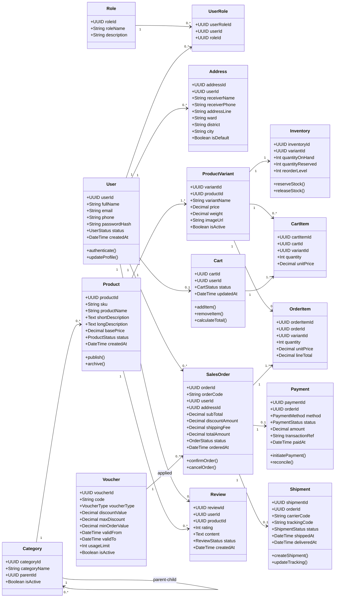
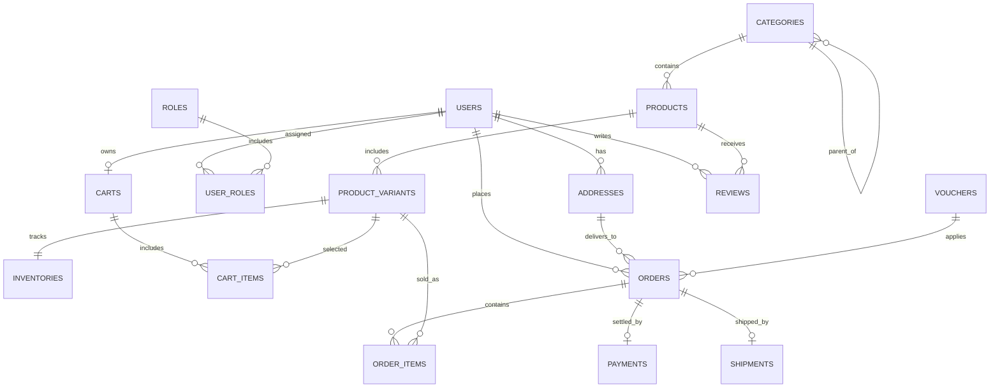
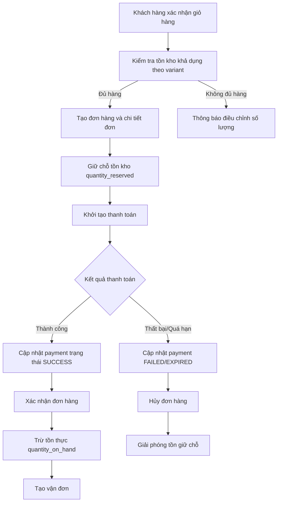
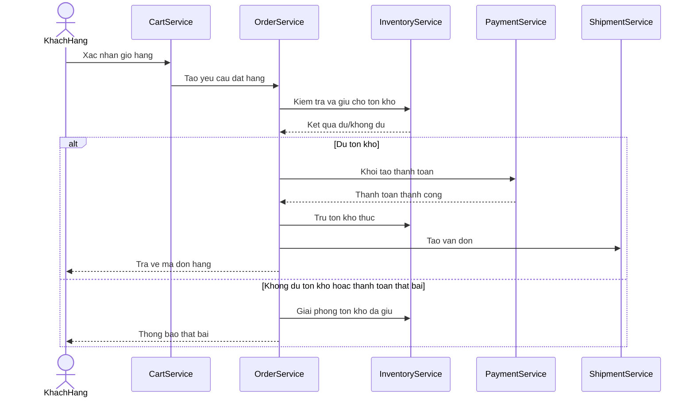
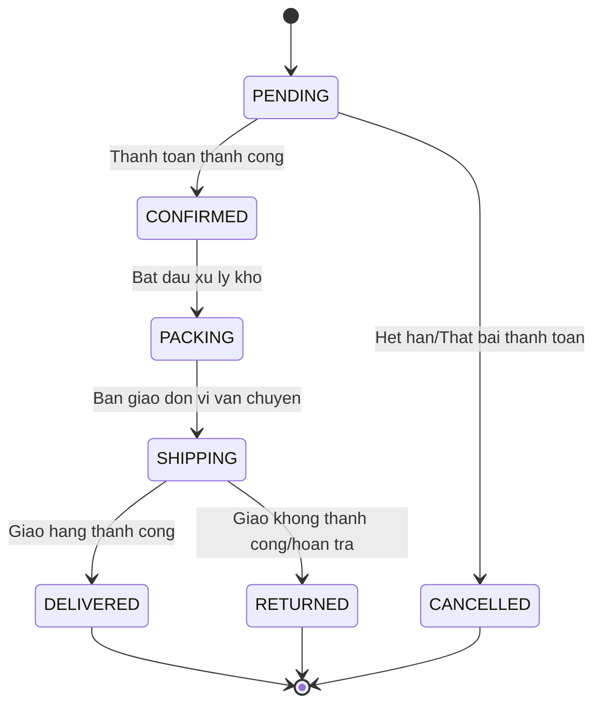

# CHƯƠNG 4: BIỂU ĐỒ LỚP VÀ THIẾT KẾ CƠ SỞ DỮ LIỆU

## 4.1. Giới thiệu chương

Chương này trình bày mô hình lớp và thiết kế cơ sở dữ liệu quan hệ cho hệ thống thương mại điện tử. Nội dung tập trung vào việc chuyển hóa yêu cầu nghiệp vụ thành cấu trúc dữ liệu nhất quán, có khả năng mở rộng và hỗ trợ vận hành ổn định. Trên cơ sở các tác nhân, use case và luồng tương tác đã xác định ở các chương trước, chương 4 làm rõ ba vấn đề cốt lõi: (1) tổ chức lớp miền nghiệp vụ và quan hệ giữa các lớp; (2) ánh xạ từ mô hình lớp sang mô hình dữ liệu quan hệ; (3) các ràng buộc dữ liệu nhằm bảo đảm toàn vẹn, chính xác và hiệu năng truy xuất.

Với đặc thù hệ thống thương mại điện tử, dữ liệu biến động liên tục theo vòng đời đơn hàng, thanh toán, tồn kho và hành vi người dùng. Do đó, mô hình thiết kế không chỉ dừng ở mô tả thực thể mà còn phải phản ánh được quy tắc nghiệp vụ xuyên suốt, bao gồm kiểm soát trạng thái, tính nhất quán giao dịch và khả năng kiểm tra đối soát. Kết quả của chương là nền tảng kỹ thuật cho các hoạt động phát triển, kiểm thử, triển khai và bảo trì hệ thống trong các giai đoạn tiếp theo.

## 4.2. Biểu đồ lớp (Class Diagram) tổng quát

### 4.2.1. Mục tiêu và nguyên tắc xây dựng biểu đồ lớp

Biểu đồ lớp được xây dựng theo nguyên tắc phân tách trách nhiệm rõ ràng giữa các nhóm đối tượng: nhóm người dùng và phân quyền, nhóm danh mục - sản phẩm, nhóm giao dịch bán hàng, nhóm hậu cần - vận chuyển, và nhóm thanh toán. Mỗi lớp biểu diễn một khái niệm nghiệp vụ độc lập, có thuộc tính mô tả trạng thái và phương thức mô tả hành vi ở mức khái niệm. Quan hệ giữa các lớp thể hiện sự phụ thuộc nghiệp vụ theo các kiểu kết hợp, kết tập hoặc liên kết nhiều - nhiều thông qua lớp trung gian.

Mô hình lớp hướng đến các tiêu chí: dễ mở rộng (thêm phương thức thanh toán, mở rộng phân loại sản phẩm), hạn chế trùng lặp dữ liệu (chuẩn hóa thông tin địa chỉ, tồn kho, chi tiết đơn hàng) và thuận lợi cho việc ánh xạ sang mô hình quan hệ.

### 4.2.2. Biểu đồ lớp tổng quát

*Hình 4.1: Biểu đồ lớp tổng quát của hệ thống thương mại điện tử.*

### 4.2.3. Phân tích các nhóm lớp chính

#### 4.2.3.1. Nhóm quản lý người dùng và phân quyền

Nhóm lớp `User`, `Role`, `UserRole`, `Address` đảm nhiệm bài toán định danh, xác thực và kiểm soát quyền truy cập. Mô hình quan hệ nhiều - nhiều giữa `User` và `Role` cho phép mở rộng linh hoạt theo từng ngữ cảnh (khách hàng, quản trị viên, nhân viên vận hành). Lớp `Address` tách riêng khỏi `User` nhằm hỗ trợ nhiều địa chỉ giao hàng, phù hợp hành vi mua sắm thực tế và giảm dư thừa dữ liệu khi phát sinh nhiều đơn hàng.

#### 4.2.3.2. Nhóm danh mục, sản phẩm và tồn kho

`Category` được thiết kế dạng phân cấp cha - con để tổ chức danh mục nhiều tầng, thuận tiện cho lọc sản phẩm và điều hướng. `Product` biểu diễn sản phẩm ở mức khái niệm, trong khi `ProductVariant` mô tả các biến thể cụ thể (màu sắc, kích thước, cấu hình), cho phép quản trị giá và tồn kho chính xác theo biến thể. `Inventory` tách thành lớp độc lập giúp thực thi các nghiệp vụ giữ chỗ tồn kho, xuất kho, hoàn kho theo vòng đời đơn hàng.

#### 4.2.3.3. Nhóm giỏ hàng và đặt hàng

`Cart` và `CartItem` đại diện trạng thái chọn mua tạm thời trước khi xác nhận giao dịch. Khi người dùng đặt hàng, dữ liệu chuyển sang `SalesOrder` và `OrderItem` để bảo toàn ảnh chụp lịch sử mua tại thời điểm giao dịch (đơn giá, số lượng, tổng dòng). Thiết kế này đảm bảo việc thay đổi giá sản phẩm sau thời điểm mua không làm sai lệch dữ liệu giao dịch đã phát sinh.

#### 4.2.3.4. Nhóm thanh toán và vận chuyển

`Payment` và `Shipment` phản ánh hai tiến trình nghiệp vụ độc lập nhưng liên quan chặt với `SalesOrder`. Sự tách biệt này cho phép hệ thống xử lý linh hoạt nhiều phương thức thanh toán, nhiều đơn vị vận chuyển và các trạng thái trung gian (chờ thanh toán, thanh toán thất bại, đang giao, giao thất bại, hoàn tất). Đồng thời, việc lưu `transactionRef` và `trackingCode` giúp đối soát ngoài hệ thống, phục vụ kiểm toán và xử lý khiếu nại.

#### 4.2.3.5. Nhóm đánh giá sản phẩm

Lớp `Review` liên kết người dùng với sản phẩm sau mua, đóng vai trò hỗ trợ minh bạch chất lượng hàng hóa và cải thiện trải nghiệm ra quyết định. Trạng thái duyệt đánh giá (`ReviewStatus`) giúp kiểm soát nội dung không phù hợp, đồng thời duy trì độ tin cậy thông tin hiển thị.

## 4.3. Chuyển đổi từ biểu đồ lớp sang mô hình dữ liệu quan hệ

### 4.3.1. Nguyên tắc chuyển đổi

Quá trình chuyển đổi áp dụng các nguyên tắc chuẩn hóa dữ liệu và bảo toàn nghiệp vụ:

1. Mỗi lớp thực thể bền vững ánh xạ thành một bảng quan hệ tương ứng.
2. Quan hệ một - nhiều được thể hiện bằng khóa ngoại tại bảng phía nhiều.
3. Quan hệ nhiều - nhiều được tách thành bảng liên kết trung gian.
4. Thuộc tính trạng thái được chuẩn hóa dưới dạng miền giá trị kiểm soát.
5. Các giá trị tính toán theo giao dịch (tổng tiền, chiết khấu, phí vận chuyển) được lưu tại đơn hàng để đảm bảo truy vết lịch sử.

Việc lựa chọn kiểu định danh `UUID` cho các bảng chính giúp tăng khả năng mở rộng phân tán và hạn chế rủi ro suy đoán dữ liệu tuần tự.

### 4.3.2. Sơ đồ quan hệ thực thể (ERD)

*Hình 4.2: Sơ đồ quan hệ thực thể (ERD) của hệ thống thương mại điện tử.*

## 4.4. Thiết kế chi tiết các bảng dữ liệu

### 4.4.1. Bảng `users`

| Tên cột | Kiểu dữ liệu | Ràng buộc | Mô tả |
| --- | --- | --- | --- |
| user_id | UUID | PK | Định danh duy nhất người dùng |
| full_name | VARCHAR(120) | NOT NULL | Họ và tên |
| email | VARCHAR(150) | NOT NULL, UNIQUE | Email đăng nhập |
| phone | VARCHAR(20) | UNIQUE | Số điện thoại liên hệ |
| password_hash | VARCHAR(255) | NOT NULL | Chuỗi băm mật khẩu |
| status | VARCHAR(20) | NOT NULL, DEFAULT 'ACTIVE' | Trạng thái tài khoản |
| created_at | TIMESTAMP | NOT NULL, DEFAULT CURRENT_TIMESTAMP | Thời điểm tạo |
| updated_at | TIMESTAMP | NOT NULL | Thời điểm cập nhật gần nhất |

### 4.4.2. Bảng `roles` và `user_roles`

| Tên bảng | Cột chính | Ràng buộc trọng yếu | Ý nghĩa |
| --- | --- | --- | --- |
| roles | role_id (UUID) | PK, role_name UNIQUE | Danh mục vai trò hệ thống |
| user_roles | user_role_id (UUID) | PK, FK user_id, FK role_id, UNIQUE(user_id, role_id) | Ánh xạ người dùng - vai trò |

### 4.4.3. Bảng `addresses`

| Tên cột | Kiểu dữ liệu | Ràng buộc | Mô tả |
| --- | --- | --- | --- |
| address_id | UUID | PK | Định danh địa chỉ |
| user_id | UUID | FK -> users(user_id), NOT NULL | Chủ sở hữu địa chỉ |
| receiver_name | VARCHAR(120) | NOT NULL | Người nhận hàng |
| receiver_phone | VARCHAR(20) | NOT NULL | Số điện thoại nhận hàng |
| address_line | VARCHAR(255) | NOT NULL | Địa chỉ chi tiết |
| ward | VARCHAR(100) | NOT NULL | Phường/Xã |
| district | VARCHAR(100) | NOT NULL | Quận/Huyện |
| city | VARCHAR(100) | NOT NULL | Tỉnh/Thành phố |
| is_default | BOOLEAN | NOT NULL, DEFAULT FALSE | Đánh dấu địa chỉ mặc định |

### 4.4.4. Bảng `categories`

| Tên cột | Kiểu dữ liệu | Ràng buộc | Mô tả |
| --- | --- | --- | --- |
| category_id | UUID | PK | Định danh danh mục |
| category_name | VARCHAR(120) | NOT NULL | Tên danh mục |
| parent_id | UUID | FK -> categories(category_id) | Danh mục cha |
| is_active | BOOLEAN | NOT NULL, DEFAULT TRUE | Trạng thái hoạt động |

### 4.4.5. Bảng `products` và `product_variants`

| Tên bảng | Cột | Kiểu dữ liệu | Ràng buộc | Mô tả |
| --- | --- | --- | --- | --- |
| products | product_id | UUID | PK | Định danh sản phẩm |
| products | category_id | UUID | FK -> categories(category_id), NOT NULL | Danh mục thuộc về |
| products | sku | VARCHAR(40) | UNIQUE, NOT NULL | Mã sản phẩm chuẩn |
| products | product_name | VARCHAR(200) | NOT NULL | Tên sản phẩm |
| products | short_description | VARCHAR(500) |  | Mô tả ngắn |
| products | long_description | TEXT |  | Mô tả chi tiết |
| products | base_price | DECIMAL(12,2) | NOT NULL | Giá cơ sở |
| products | status | VARCHAR(20) | NOT NULL, DEFAULT 'DRAFT' | Trạng thái hiển thị |
| product_variants | variant_id | UUID | PK | Định danh biến thể |
| product_variants | product_id | UUID | FK -> products(product_id), NOT NULL | Sản phẩm gốc |
| product_variants | variant_name | VARCHAR(150) | NOT NULL | Tên biến thể |
| product_variants | price | DECIMAL(12,2) | NOT NULL | Giá bán biến thể |
| product_variants | weight | DECIMAL(10,3) | DEFAULT 0 | Khối lượng phục vụ tính phí giao hàng |
| product_variants | image_url | VARCHAR(255) |  | Ảnh đại diện |
| product_variants | is_active | BOOLEAN | NOT NULL, DEFAULT TRUE | Trạng thái kinh doanh |

### 4.4.6. Bảng `inventories`

| Tên cột | Kiểu dữ liệu | Ràng buộc | Mô tả |
| --- | --- | --- | --- |
| inventory_id | UUID | PK | Định danh bản ghi tồn kho |
| variant_id | UUID | FK -> product_variants(variant_id), UNIQUE, NOT NULL | Biến thể được theo dõi |
| quantity_on_hand | INT | NOT NULL, DEFAULT 0 | Số lượng tồn thực |
| quantity_reserved | INT | NOT NULL, DEFAULT 0 | Số lượng đã giữ chỗ |
| reorder_level | INT | NOT NULL, DEFAULT 0 | Ngưỡng cảnh báo nhập thêm |
| updated_at | TIMESTAMP | NOT NULL | Thời điểm cập nhật |

### 4.4.7. Bảng `carts` và `cart_items`

| Tên bảng | Cột | Kiểu dữ liệu | Ràng buộc | Mô tả |
| --- | --- | --- | --- | --- |
| carts | cart_id | UUID | PK | Định danh giỏ hàng |
| carts | user_id | UUID | FK -> users(user_id), UNIQUE, NOT NULL | Chủ sở hữu giỏ |
| carts | status | VARCHAR(20) | NOT NULL, DEFAULT 'ACTIVE' | Trạng thái giỏ |
| carts | updated_at | TIMESTAMP | NOT NULL | Thời điểm cập nhật |
| cart_items | cart_item_id | UUID | PK | Định danh dòng giỏ |
| cart_items | cart_id | UUID | FK -> carts(cart_id), NOT NULL | Giỏ hàng chứa dòng |
| cart_items | variant_id | UUID | FK -> product_variants(variant_id), NOT NULL | Biến thể được chọn |
| cart_items | quantity | INT | NOT NULL | Số lượng chọn mua |
| cart_items | unit_price | DECIMAL(12,2) | NOT NULL | Đơn giá tại thời điểm thêm |
| cart_items | UNIQUE(cart_id, variant_id) |  | Ràng buộc duy nhất | Tránh trùng dòng sản phẩm |

### 4.4.8. Bảng `vouchers`

| Tên cột | Kiểu dữ liệu | Ràng buộc | Mô tả |
| --- | --- | --- | --- |
| voucher_id | UUID | PK | Định danh mã giảm giá |
| code | VARCHAR(50) | UNIQUE, NOT NULL | Mã áp dụng |
| voucher_type | VARCHAR(20) | NOT NULL | Theo phần trăm hoặc số tiền cố định |
| discount_value | DECIMAL(12,2) | NOT NULL | Giá trị giảm |
| max_discount | DECIMAL(12,2) |  | Mức giảm tối đa |
| min_order_value | DECIMAL(12,2) | DEFAULT 0 | Giá trị đơn tối thiểu |
| valid_from | TIMESTAMP | NOT NULL | Bắt đầu hiệu lực |
| valid_to | TIMESTAMP | NOT NULL | Kết thúc hiệu lực |
| usage_limit | INT |  | Số lượt sử dụng tối đa |
| is_active | BOOLEAN | NOT NULL, DEFAULT TRUE | Trạng thái hoạt động |

### 4.4.9. Bảng `orders` và `order_items`

| Tên bảng | Cột | Kiểu dữ liệu | Ràng buộc | Mô tả |
| --- | --- | --- | --- | --- |
| orders | order_id | UUID | PK | Định danh đơn hàng |
| orders | order_code | VARCHAR(30) | UNIQUE, NOT NULL | Mã đơn hàng nghiệp vụ |
| orders | user_id | UUID | FK -> users(user_id), NOT NULL | Khách đặt hàng |
| orders | address_id | UUID | FK -> addresses(address_id), NOT NULL | Địa chỉ nhận |
| orders | voucher_id | UUID | FK -> vouchers(voucher_id) | Mã giảm giá áp dụng |
| orders | sub_total | DECIMAL(12,2) | NOT NULL | Tạm tính trước giảm giá |
| orders | discount_amount | DECIMAL(12,2) | NOT NULL, DEFAULT 0 | Giá trị giảm |
| orders | shipping_fee | DECIMAL(12,2) | NOT NULL, DEFAULT 0 | Phí vận chuyển |
| orders | total_amount | DECIMAL(12,2) | NOT NULL | Tổng thanh toán |
| orders | status | VARCHAR(20) | NOT NULL, DEFAULT 'PENDING' | Trạng thái đơn hàng |
| orders | ordered_at | TIMESTAMP | NOT NULL, DEFAULT CURRENT_TIMESTAMP | Thời điểm đặt |
| order_items | order_item_id | UUID | PK | Định danh chi tiết đơn |
| order_items | order_id | UUID | FK -> orders(order_id), NOT NULL | Đơn hàng cha |
| order_items | variant_id | UUID | FK -> product_variants(variant_id), NOT NULL | Biến thể đã mua |
| order_items | quantity | INT | NOT NULL | Số lượng |
| order_items | unit_price | DECIMAL(12,2) | NOT NULL | Đơn giá chốt |
| order_items | line_total | DECIMAL(12,2) | NOT NULL | Thành tiền dòng |

### 4.4.10. Bảng `payments`

| Tên cột | Kiểu dữ liệu | Ràng buộc | Mô tả |
| --- | --- | --- | --- |
| payment_id | UUID | PK | Định danh thanh toán |
| order_id | UUID | FK -> orders(order_id), UNIQUE, NOT NULL | Đơn hàng tương ứng |
| method | VARCHAR(20) | NOT NULL | Phương thức thanh toán |
| status | VARCHAR(20) | NOT NULL, DEFAULT 'INITIATED' | Trạng thái thanh toán |
| amount | DECIMAL(12,2) | NOT NULL | Số tiền thanh toán |
| transaction_ref | VARCHAR(120) | UNIQUE | Mã giao dịch đối soát |
| paid_at | TIMESTAMP |  | Thời điểm thanh toán thành công |

### 4.4.11. Bảng `shipments`

| Tên cột | Kiểu dữ liệu | Ràng buộc | Mô tả |
| --- | --- | --- | --- |
| shipment_id | UUID | PK | Định danh vận đơn |
| order_id | UUID | FK -> orders(order_id), UNIQUE, NOT NULL | Đơn hàng tương ứng |
| carrier_code | VARCHAR(30) | NOT NULL | Mã đơn vị vận chuyển |
| tracking_code | VARCHAR(100) | UNIQUE | Mã theo dõi |
| status | VARCHAR(20) | NOT NULL, DEFAULT 'PENDING_PICKUP' | Trạng thái giao hàng |
| shipped_at | TIMESTAMP |  | Thời điểm bàn giao đơn vị vận chuyển |
| delivered_at | TIMESTAMP |  | Thời điểm giao thành công |

### 4.4.12. Bảng `reviews`

| Tên cột | Kiểu dữ liệu | Ràng buộc | Mô tả |
| --- | --- | --- | --- |
| review_id | UUID | PK | Định danh đánh giá |
| user_id | UUID | FK -> users(user_id), NOT NULL | Người đánh giá |
| product_id | UUID | FK -> products(product_id), NOT NULL | Sản phẩm được đánh giá |
| rating | INT | NOT NULL | Điểm đánh giá (1-5) |
| content | TEXT |  | Nội dung nhận xét |
| status | VARCHAR(20) | NOT NULL, DEFAULT 'PENDING' | Trạng thái kiểm duyệt |
| created_at | TIMESTAMP | NOT NULL, DEFAULT CURRENT_TIMESTAMP | Thời điểm tạo đánh giá |

## 4.5. Quy trình và luồng xử lý dữ liệu trọng yếu

### 4.5.1. Luồng xử lý đặt hàng - thanh toán - cập nhật tồn kho

*Hình 4.3: Biểu đồ luồng xử lý nghiệp vụ đặt hàng và thanh toán.*

Luồng trên bảo đảm hai mục tiêu quan trọng: (1) không bán vượt tồn kho thông qua cơ chế giữ chỗ; (2) không mất nhất quán dữ liệu khi thanh toán thất bại nhờ cơ chế hoàn tác nghiệp vụ ở mức trạng thái.

### 4.5.2. Biểu đồ tuần tự cho giao dịch đặt hàng

*Hình 4.4: Biểu đồ tuần tự nghiệp vụ đặt hàng.*

## 4.6. Phân tích ràng buộc dữ liệu và bảo đảm toàn vẹn

### 4.6.1. Toàn vẹn thực thể và toàn vẹn tham chiếu

Tất cả bảng nghiệp vụ cốt lõi đều sử dụng khóa chính độc lập để định danh bản ghi. Các khóa ngoại được thiết kế theo quan hệ nghiệp vụ chặt chẽ, tránh phát sinh bản ghi mồ côi, đặc biệt tại các bảng giao dịch như `order_items`, `payments`, `shipments`. Với các quan hệ có tính bắt buộc, ràng buộc `NOT NULL` được áp dụng để loại trừ trạng thái dữ liệu không hợp lệ.

### 4.6.2. Toàn vẹn miền giá trị

Các thuộc tính trạng thái (đơn hàng, thanh toán, giao hàng, tài khoản) được giới hạn trong tập giá trị xác định trước. Các cột tiền tệ dùng kiểu `DECIMAL(12,2)` để bảo đảm chính xác số học tài chính. Thuộc tính đánh giá (`rating`) giới hạn theo thang điểm chuẩn, qua đó nâng cao độ tin cậy dữ liệu phân tích chất lượng dịch vụ.

### 4.6.3. Chỉ mục và tối ưu truy vấn nghiệp vụ

Để hỗ trợ truy vấn thường xuyên, cần ưu tiên tạo chỉ mục cho các trường: `email`, `order_code`, `transaction_ref`, `tracking_code`, `product_id`, `category_id`, `status`, `ordered_at`. Cách tiếp cận này cải thiện hiệu năng cho các tác vụ tìm kiếm sản phẩm, tra cứu đơn hàng, đối soát thanh toán và báo cáo vận hành theo thời gian.

## 4.7. Mô hình trạng thái đơn hàng và tác động dữ liệu

### 4.7.1. Biểu đồ trạng thái đơn hàng

*Hình 4.5: Biểu đồ trạng thái vòng đời đơn hàng.*

### 4.7.2. Phân tích tác động dữ liệu theo trạng thái

Mỗi chuyển trạng thái của đơn hàng đều kéo theo cập nhật dữ liệu tại nhiều bảng liên quan. Ví dụ, chuyển từ `PENDING` sang `CONFIRMED` yêu cầu đồng bộ trạng thái thanh toán và khóa các thay đổi giỏ hàng tương ứng; chuyển sang `CANCELLED` cần giải phóng lượng hàng đã giữ chỗ. Do đó, xử lý trạng thái cần được thiết kế theo đơn vị giao dịch nghiệp vụ nhất quán để tránh sai lệch giữa đơn hàng, thanh toán và tồn kho.

## 4.8. Kết luận chương

Chương 4 đã trình bày đầy đủ mô hình lớp tổng quát và thiết kế cơ sở dữ liệu quan hệ cho hệ thống thương mại điện tử, từ cấu trúc thực thể đến các quy tắc ràng buộc và luồng xử lý dữ liệu trọng yếu. Mô hình đề xuất bảo đảm tính nhất quán nghiệp vụ, hỗ trợ mở rộng theo quy mô vận hành và tạo nền tảng vững chắc cho các hoạt động phát triển giao diện, tích hợp dịch vụ và kiểm thử hệ thống ở các chương tiếp theo. Việc kết hợp giữa biểu đồ lớp, ERD, biểu đồ luồng và biểu đồ trạng thái giúp tăng tính minh bạch thiết kế, đồng thời giảm rủi ro khi chuyển từ giai đoạn phân tích sang triển khai thực tế.
