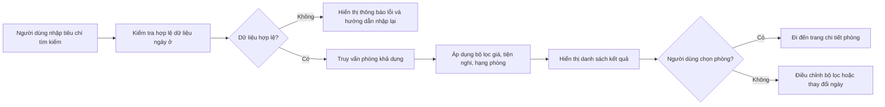
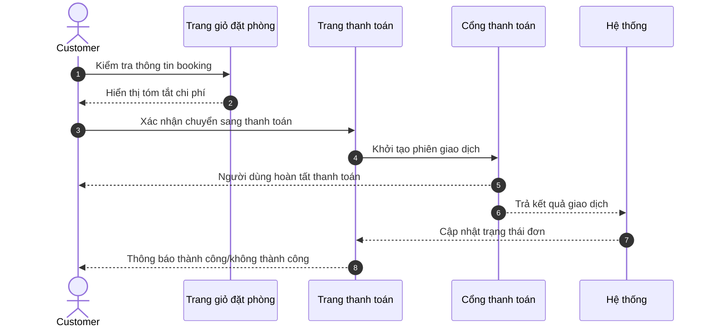
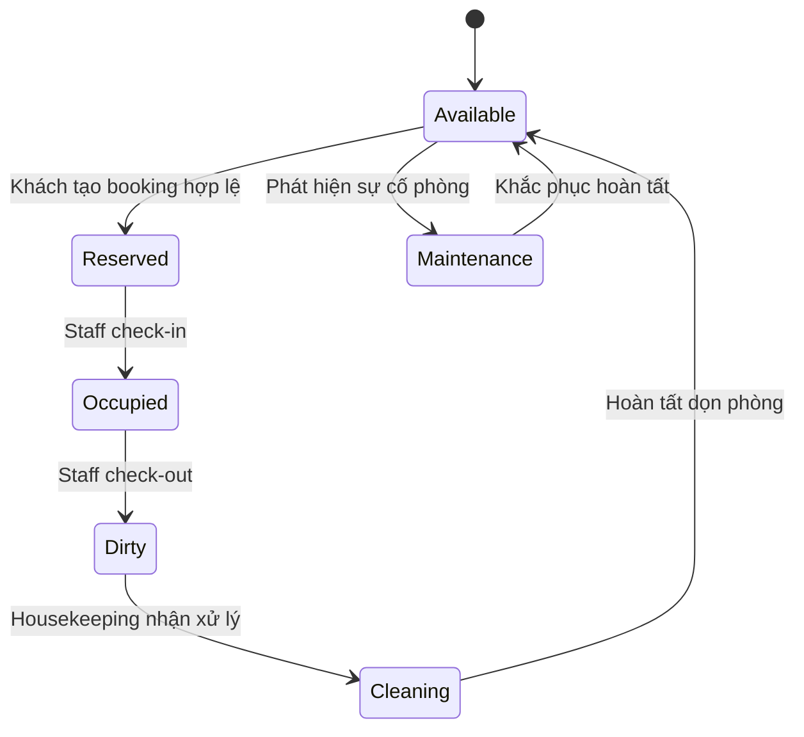
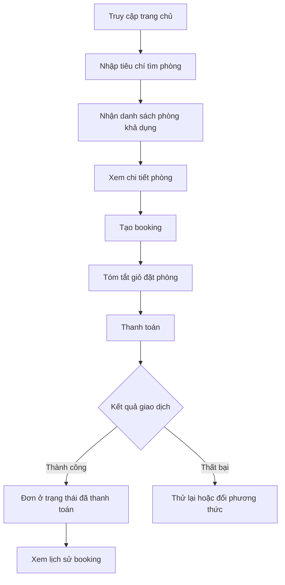
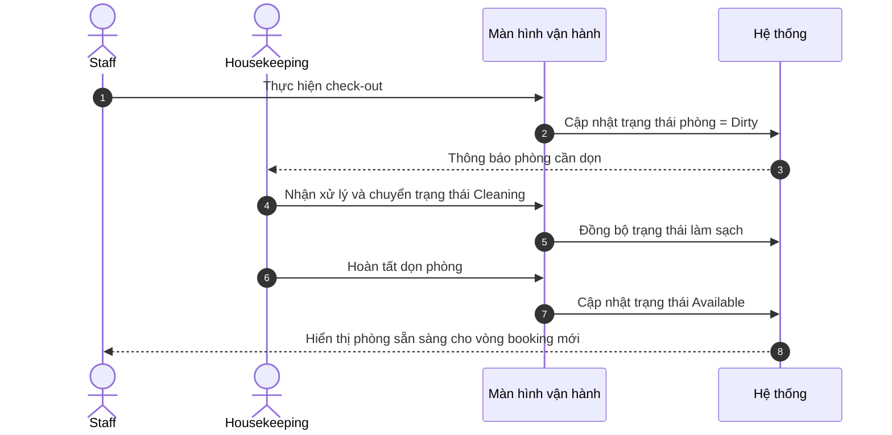

# CHƯƠNG 5: THIẾT KẾ GIAO DIỆN (UI/UX - WIREFRAME / MOCKUP)

## 5.1. Giới thiệu chương

Chương này trình bày định hướng và kết quả thiết kế giao diện người dùng cho hệ thống đặt phòng khách sạn trực tuyến, với mục tiêu bảo đảm tính dễ sử dụng, nhất quán nghiệp vụ và hỗ trợ hiệu quả cho ba nhóm người dùng trọng tâm: khách hàng, nhân viên vận hành và quản trị viên. Nếu các chương trước tập trung vào yêu cầu chức năng, luồng xử lý và mô hình dữ liệu, thì chương này cụ thể hóa các yêu cầu đó thành cấu trúc màn hình, mô hình tương tác và quy tắc trải nghiệm ở mức người dùng cuối.

Thiết kế giao diện được xây dựng theo nguyên tắc lấy tác vụ làm trung tâm, nghĩa là mỗi màn hình phải phục vụ rõ một mục tiêu nghiệp vụ cụ thể: tìm kiếm phòng, đặt phòng, thanh toán, theo dõi đơn và vận hành lưu trú. Đồng thời, các quyết định về bố cục, điều hướng, biểu mẫu và phản hồi trạng thái được chuẩn hóa để giảm sai sót thao tác, tăng khả năng hoàn tất giao dịch và hỗ trợ mở rộng hệ thống khi quy mô người dùng tăng.

## 5.2. Danh sách các trang giao diện chính

### 5.2.1. Phân nhóm giao diện theo vai trò

Để bảo đảm tính nhất quán và tối ưu luồng thao tác, giao diện được chia thành ba phân hệ:

- Phân hệ khách hàng: tập trung vào hành trình khám phá phòng, đặt phòng và hậu giao dịch.
- Phân hệ vận hành nội bộ (Staff/Housekeeping): tập trung vào check-in/check-out, cập nhật trạng thái phòng, xử lý phát sinh tại quầy.
- Phân hệ quản trị (Admin): tập trung vào dashboard, quản lý danh mục, cấu hình chính sách giá và báo cáo điều hành.

### 5.2.2. Danh mục màn hình chi tiết

*Bảng 5.1: Danh mục các trang giao diện chính theo phân hệ người dùng.*

| STT | Màn hình | Vai trò sử dụng | Mục tiêu nghiệp vụ | Mức độ ưu tiên |
| --- | --- | --- | --- | --- |
| 1 | Trang chủ | Guest/Customer | Truyền tải thông điệp dịch vụ, điều hướng nhanh đến tìm phòng | Rất cao |
| 2 | Danh sách phòng (tìm kiếm - lọc) | Guest/Customer | Tra cứu phòng khả dụng theo ngày ở, số khách, ngân sách | Rất cao |
| 3 | Chi tiết phòng | Guest/Customer | Cung cấp thông tin đầy đủ để hỗ trợ quyết định đặt phòng | Rất cao |
| 4 | Giỏ đặt phòng/tóm tắt booking | Customer | Xác nhận thông tin lựa chọn trước khi thanh toán | Cao |
| 5 | Thanh toán | Customer | Hoàn tất giao dịch và ghi nhận kết quả thanh toán | Rất cao |
| 6 | Lịch sử booking và hồ sơ cá nhân | Customer | Theo dõi trạng thái đơn, quản lý thông tin tài khoản | Cao |
| 7 | Dashboard quản trị | Admin | Giám sát chỉ số kinh doanh và vận hành theo thời gian | Cao |
| 8 | Quản lý phòng và giá phòng | Admin | Cấu hình inventory, chính sách giá và tình trạng khai thác | Rất cao |
| 9 | Quản lý booking | Admin/Staff | Kiểm soát vòng đời booking, xử lý ngoại lệ và hỗ trợ khách | Rất cao |
| 10 | Quản lý người dùng và phân quyền | Admin | Quản trị tài khoản, vai trò và mức truy cập | Trung bình |
| 11 | Màn hình vận hành lễ tân (check-in/check-out) | Staff | Tăng tốc tác vụ tại quầy, giảm sai lệch trạng thái lưu trú | Rất cao |
| 12 | Màn hình buồng phòng (housekeeping board) | Housekeeping | Cập nhật trạng thái dọn phòng theo thời gian thực | Cao |

*Hình 5.1: Bản đồ điều hướng tổng thể thể hiện quan hệ truy cập giữa các màn hình theo từng vai trò người dùng.*

## 5.3. Wireframe/Mockup từng trang trọng tâm

### 5.3.1. Trang chủ

Trang chủ được thiết kế như điểm vào chiến lược cho toàn bộ hành trình người dùng. Về bố cục, màn hình gồm: (1) khu vực tiêu đề và điều hướng toàn cục (Header), (2) khối tìm phòng nhanh đặt ở vị trí ưu tiên, (3) khu vực giới thiệu hạng phòng nổi bật, (4) phần lợi ích dịch vụ và đánh giá khách hàng, (5) footer chứa thông tin liên hệ và chính sách.

Các thành phần tương tác trọng tâm bao gồm nút hành động chính "Đặt phòng ngay", bộ chọn ngày ở và số khách, liên kết đến trang chi tiết phòng, cùng vùng thông báo ưu đãi theo mùa. Cách tổ chức này nhằm giảm số bước chuyển trang trước khi người dùng thực hiện truy vấn tìm phòng.

*Hình 5.2: Wireframe trang chủ thể hiện khối tìm phòng nhanh và các khu vực nội dung chính định hướng chuyển đổi.*

### 5.3.2. Trang danh sách phòng (có lọc và tìm kiếm)

Màn hình danh sách phòng đóng vai trò "bộ lọc quyết định" trong hành trình mua dịch vụ. Thiết kế gồm hai vùng: sidebar bộ lọc và vùng kết quả. Sidebar chứa các tiêu chí ngày nhận/trả phòng, số khách, khoảng giá, hạng phòng, tiện nghi; vùng kết quả hiển thị thẻ phòng với ảnh đại diện, mô tả ngắn, giá theo đêm, trạng thái khả dụng và nút xem chi tiết.

Về UX, bộ lọc được thiết kế theo nguyên tắc phản hồi tức thời và có khả năng đặt lại nhanh. Hệ thống hiển thị rõ số kết quả phù hợp, cảnh báo khi không có phòng, đồng thời đề xuất mở rộng khoảng ngày để tăng xác suất đặt thành công.

*Hình 5.3: Wireframe trang danh sách phòng với vùng bộ lọc bên trái và danh sách kết quả bên phải.*

### 5.3.3. Trang chi tiết phòng

Màn hình chi tiết phòng tập trung làm rõ giá trị sản phẩm dịch vụ, hạn chế mơ hồ trước khi đặt. Cấu trúc gồm thư viện ảnh, thông tin loại phòng, sức chứa, tiện nghi, chính sách hủy, ghi chú quan trọng và khối đặt phòng nhanh. Mọi thông tin liên quan đến giá phải minh bạch theo từng đêm hoặc gói dịch vụ để tránh sai kỳ vọng ở bước thanh toán.

Ngoài nút "Đặt phòng", giao diện ưu tiên hiển thị các thông tin gia tăng độ tin cậy như đánh giá khách trước, điều kiện hoàn/hủy và câu hỏi thường gặp. Đây là điểm then chốt giúp cải thiện tỷ lệ chuyển đổi từ xem phòng sang tạo booking.

*Hình 5.4: Mockup trang chi tiết phòng với khối thông tin giá, chính sách và hành động đặt phòng được nhấn mạnh.*

### 5.3.4. Trang giỏ đặt phòng và trang thanh toán

Hai màn hình này được thiết kế liên thông để giảm rủi ro bỏ dở giao dịch. Trang giỏ đặt phòng trình bày tóm tắt thông tin booking: tên phòng, thời gian lưu trú, số khách, chi phí tạm tính, ưu đãi áp dụng và tổng tiền. Tại đây người dùng có thể chỉnh sửa thông tin trước khi chuyển sang thanh toán.

Trang thanh toán ưu tiên tính minh bạch và an toàn: hiển thị rõ phương thức thanh toán, trạng thái giao dịch, mốc thời gian hết hạn và thông báo kết quả. Giao diện phải xử lý đầy đủ các trạng thái thành công, thất bại, chờ xác nhận, đồng thời cung cấp hướng dẫn quay lại hoặc thử lại khi cần.

*Hình 5.5: Wireframe trang giỏ đặt phòng với khối tóm tắt chi phí và hành động xác nhận.*

*Hình 5.6: Wireframe trang thanh toán thể hiện phương thức thanh toán, trạng thái giao dịch và thông báo phản hồi.*

### 5.3.5. Trang lịch sử booking và hồ sơ cá nhân

Màn hình này giúp khách hàng quản trị vòng đời giao dịch sau mua. Bố cục ưu tiên danh sách booking có bộ lọc trạng thái (chờ thanh toán, đã thanh toán, đã hủy, đã hoàn tất), khả năng xem chi tiết từng đơn, thao tác hủy theo điều kiện chính sách và truy xuất hóa đơn/biên nhận khi cần.

Khu vực hồ sơ cá nhân đặt trong cùng phân hệ để người dùng cập nhật thông tin liên hệ, mật khẩu và tùy chọn nhận thông báo. Thiết kế này tăng tính liên tục trải nghiệm và giảm phân mảnh thao tác giữa các màn hình.

*Hình 5.7: Mockup trang lịch sử booking kết hợp quản lý hồ sơ cá nhân theo cấu trúc điều hướng theo tab.*

### 5.3.6. Giao diện quản trị và vận hành nội bộ

#### 5.3.6.1. Dashboard quản trị

Dashboard là màn hình tổng hợp chỉ số chiến lược phục vụ điều hành: doanh thu theo kỳ, tỷ lệ lấp đầy phòng, số booking theo trạng thái, tỷ lệ hủy và hiệu suất vận hành. Thiết kế sử dụng thẻ KPI kết hợp biểu đồ xu hướng, cho phép lọc theo mốc thời gian nhằm hỗ trợ quyết định nhanh.

#### 5.3.6.2. Màn hình quản lý phòng/booking/người dùng

Các màn hình quản trị dữ liệu sử dụng cấu trúc bảng chuẩn hóa gồm: thanh tìm kiếm, bộ lọc nâng cao, bảng dữ liệu, thao tác nhanh theo hàng, phân trang và hộp thoại xác nhận cho hành động quan trọng. Cách tổ chức này hỗ trợ xử lý khối lượng dữ liệu lớn mà vẫn bảo đảm khả năng truy vết thao tác.

#### 5.3.6.3. Màn hình vận hành lễ tân và buồng phòng

Màn hình lễ tân tối ưu thao tác check-in/check-out theo mã booking và trạng thái phòng theo thời gian thực. Màn hình buồng phòng tập trung vào "room board" để nhân viên cập nhật trạng thái `Dirty`, `Cleaning`, `Available`, `Maintenance`. Việc đồng bộ trực quan này giúp giảm độ trễ thông tin giữa các bộ phận.

*Hình 5.8: Mockup dashboard quản trị với nhóm chỉ số KPI, biểu đồ xu hướng và bộ lọc thời gian.*

*Hình 5.9: Wireframe màn hình vận hành nội bộ phục vụ check-in/check-out và cập nhật trạng thái phòng theo thời gian thực.*

## 5.4. Quy trình và luồng xử lý giao diện

### 5.4.1. Luồng trải nghiệm khách hàng từ tìm kiếm đến hoàn tất booking

Luồng trên cho thấy giao diện không chỉ đóng vai trò hiển thị dữ liệu mà còn điều phối hành vi người dùng theo trình tự nghiệp vụ chuẩn, từ đó giảm sai lệch dữ liệu đầu vào và tăng khả năng hoàn tất giao dịch.

### 5.4.2. Luồng vận hành nội bộ và phối hợp liên bộ phận

Luồng phối hợp này giúp thu hẹp khoảng trễ thông tin giữa lễ tân và buồng phòng, qua đó giảm nguy cơ bán sai trạng thái phòng và cải thiện công suất khai thác.

## 5.5. Nguyên tắc thiết kế UI/UX áp dụng

### 5.5.1. Tính nhất quán giao diện và điều hướng

Tất cả phân hệ đều sử dụng quy ước thống nhất về vị trí thành phần (header, menu điều hướng, vùng nội dung, khu vực cảnh báo), ngôn ngữ hiển thị và mẫu phản hồi thao tác. Nhất quán giúp giảm thời gian làm quen của người dùng và hạn chế lỗi do thay đổi ngữ cảnh màn hình.

### 5.5.2. Tối ưu khả năng thao tác và giảm sai sót

Biểu mẫu nhập liệu ưu tiên trường bắt buộc rõ ràng, kiểm tra dữ liệu theo ngữ cảnh và phản hồi tức thời khi nhập sai. Các hành động nhạy cảm như hủy booking hoặc thay đổi trạng thái vận hành đều có bước xác nhận để hạn chế thao tác ngoài ý muốn.

### 5.5.3. Minh bạch thông tin và trạng thái hệ thống

Hệ thống hiển thị rõ trạng thái giao dịch, tiến trình xử lý và nguyên nhân lỗi theo ngôn ngữ dễ hiểu. Đặc biệt, các màn hình liên quan thanh toán và chính sách hủy phải cung cấp thông tin đầy đủ để đảm bảo quyền lợi khách hàng và giảm tranh chấp sau giao dịch.

### 5.5.4. Khả năng đáp ứng đa thiết bị (Responsive)

Giao diện được thiết kế tương thích từ màn hình di động đến máy tính để bàn, ưu tiên chiến lược mobile-first cho phân hệ khách hàng. Các thành phần dữ liệu lớn ở phân hệ quản trị sử dụng bố cục thích nghi để vẫn đảm bảo đọc được trên thiết bị có kích thước vừa và nhỏ.

### 5.5.5. Hỗ trợ khả năng tiếp cận và hiệu quả vận hành

Thiết kế chú trọng độ tương phản màu phù hợp, kích thước chữ dễ đọc và trạng thái điều khiển rõ ràng, giúp mở rộng khả năng sử dụng cho nhiều nhóm người dùng. Với phân hệ nội bộ, UI tập trung rút ngắn số bước thao tác và tăng khả năng quan sát nhanh nhằm nâng cao hiệu suất vận hành thực tế.

*Bảng 5.2: Bộ tiêu chí đánh giá chất lượng thiết kế giao diện.*

| Nhóm tiêu chí | Nội dung đánh giá | Chỉ báo kiểm chứng |
| --- | --- | --- |
| Dễ học, dễ dùng | Người dùng mới có thể hoàn thành tác vụ cốt lõi không cần hướng dẫn sâu | Tỷ lệ hoàn tất tìm phòng/đặt phòng trong lần đầu sử dụng |
| Hiệu quả thao tác | Số bước thực hiện cho mỗi nghiệp vụ được tối ưu | Thời gian trung bình hoàn tất quy trình booking |
| Giảm lỗi người dùng | Form và hành động có kiểm soát đầu vào/chọn nhầm | Tỷ lệ lỗi nhập liệu và số lần hủy thao tác |
| Tính minh bạch | Trạng thái giao dịch và thông báo hệ thống rõ ràng | Tỷ lệ yêu cầu hỗ trợ liên quan trạng thái đơn |
| Nhất quán hệ thống | Cùng mẫu điều hướng, cảnh báo, cấu trúc màn hình | Kết quả đánh giá heuristic nội bộ theo checklist |
| Khả năng mở rộng | Dễ bổ sung màn hình/chức năng mới không phá vỡ trải nghiệm | Thời gian tích hợp module mới vào điều hướng chung |

## 5.6. Phân tích nghiệp vụ - chức năng từ góc độ giao diện

### 5.6.1. Liên kết giữa giao diện và vòng đời booking

Mỗi trạng thái booking đều có biểu diễn giao diện tương ứng để người dùng nhận biết và hành động chính xác: `PendingPayment` đi kèm thông báo thời hạn thanh toán; `Paid` đi kèm xác nhận thành công và hướng dẫn check-in; `Cancelled` đi kèm lý do hủy và chỉ dẫn tiếp theo. Việc ánh xạ trạng thái nghiệp vụ lên UI giúp giảm hiểu nhầm và tăng tính tin cậy hệ thống.

### 5.6.2. Liên kết giữa giao diện và vận hành trạng thái phòng

Trong phân hệ nội bộ, trạng thái phòng được trực quan hóa theo mã màu và nhãn chuẩn. Nhân viên có thể nhận biết nhanh phòng nào sẵn sàng bán, phòng nào cần dọn hoặc bảo trì, từ đó phối hợp liên bộ phận hiệu quả hơn. Đây là yếu tố trực tiếp tác động đến công suất khai thác phòng và chất lượng phục vụ tại điểm lưu trú.

### 5.6.3. Liên kết giữa giao diện quản trị và ra quyết định

Dashboard và các màn hình báo cáo không chỉ phục vụ theo dõi mà còn hỗ trợ ra quyết định điều hành, chẳng hạn điều chỉnh giá theo mùa, mở/đóng inventory theo công suất hoặc tăng cường nguồn lực buồng phòng ở giai đoạn cao điểm. Vì vậy, giao diện quản trị được thiết kế theo hướng ưu tiên thông tin quan trọng, giảm nhiễu và tăng khả năng so sánh theo kỳ thời gian.

## 5.7. Kết luận chương

Chương 5 đã xây dựng đầy đủ định hướng thiết kế UI/UX cho hệ thống đặt phòng khách sạn trực tuyến thông qua danh mục màn hình, mô tả wireframe/mockup, các luồng tương tác trọng yếu và bộ nguyên tắc thiết kế nhất quán. Nội dung chương thể hiện rõ vai trò của giao diện như một thành phần nghiệp vụ quan trọng, không chỉ hỗ trợ hiển thị mà còn điều phối hành vi người dùng theo đúng quy trình vận hành.

Kết quả của chương tạo nền tảng trực tiếp cho giai đoạn hiện thực hóa sản phẩm, kiểm thử trải nghiệm người dùng và tối ưu chuyển đổi giao dịch. Đồng thời, cấu trúc giao diện đã được tổ chức theo hướng mở rộng, đáp ứng yêu cầu phát triển hệ thống trong các pha nâng cấp tiếp theo mà vẫn duy trì tính nhất quán toàn cục.
