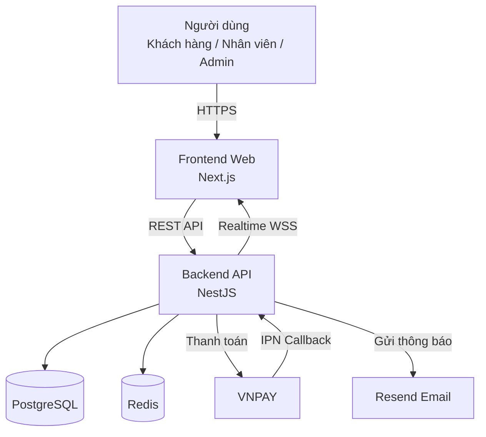
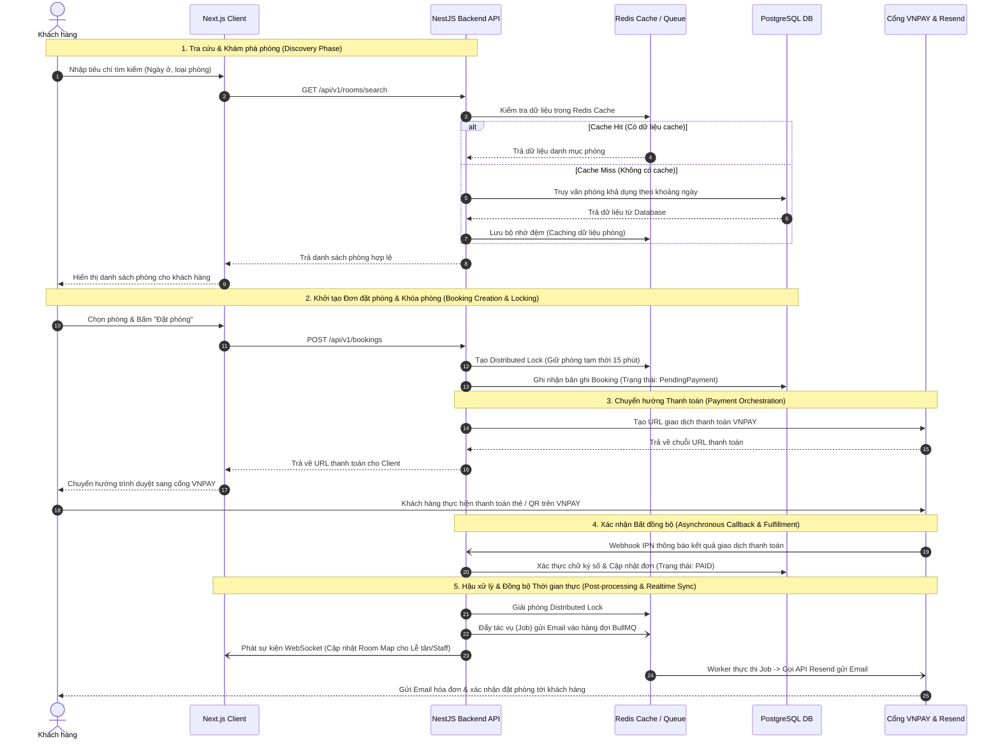

# CHƯƠNG 6: LỰA CHỌN CÔNG CỤ PHÁT TRIỂN HỆ THỐNG

## 6.1. Giới thiệu chương

Việc lựa chọn các công cụ và bộ giải pháp công nghệ (Tech Stack) đóng vai trò quyết định đến sự thành công của dự án "Hệ thống đặt phòng khách sạn trực tuyến" (Online Hotel Booking System). Dựa trên các phân tích chuyên sâu về yêu cầu nghiệp vụ (đảm bảo tính toàn vẹn dữ liệu đặt phòng, xử lý đồng thời chống overbooking), yêu cầu phi chức năng (thời gian phản hồi nhanh dưới 2s, bảo mật thanh toán, khả năng mở rộng hệ thống) và cấu trúc quản lý mã nguồn Monorepo, chương này trình bày chi tiết và chốt danh sách các công nghệ được áp dụng trong toàn bộ vòng đời phát triển hệ thống.

---

## 6.2. Giới thiệu các công nghệ dự kiến

Hệ thống áp dụng kiến trúc hiện đại, phân tách rõ ràng giữa lớp giao diện (Frontend) và lớp dịch vụ xử lý nghiệp vụ (Backend), kết hợp với hạ tầng cơ sở dữ liệu mạnh mẽ và các dịch vụ tích hợp bên thứ ba. Tất cả công cụ được liệt kê dưới đây là lựa chọn chính thức và duy nhất được sử dụng cho việc triển khai dự án.

### 6.2.1. Lớp xử lý nghiệp vụ (Backend)

*Bảng 6.1: Danh mục công nghệ lớp xử lý nghiệp vụ (Backend).* 

| Công nghệ | Phiên bản | Vai trò & Mục đích sử dụng trong hệ thống |
| :--- | :---: | :--- |
| **NestJS** | 10.x | Framework chính xây dựng các dịch vụ RESTful API theo cấu trúc module hóa. Quản lý luồng nghiệp vụ, dependency injection, cùng với hệ thống Guard (phân quyền), Interceptor (xử lý dữ liệu) và Filter (quản lý lỗi tập trung). |
| **TypeScript** | 5.x | Ngôn ngữ lập trình chính cho toàn bộ hệ thống (cả Backend và Frontend), đảm bảo tính chặt chẽ về kiểu dữ liệu (type-safe) xuyên suốt toàn bộ Monorepo. |
| **Prisma ORM** | 6.x | Công cụ ánh xạ dữ liệu quan hệ (Object-Relational Mapping) an toàn với kiểu dữ liệu. Quản lý tự động các lược đồ cơ sở dữ liệu (schema migrations) và thực thi truy vấn hiệu suất cao. |
| **class-validator & class-transformer** | 0.14.x | Bộ thư viện kiểm tra (validation) và chuyển đổi (serialization) dữ liệu đầu vào (DTO) tự động tại các API endpoint trước khi đi vào tầng xử lý logic nghiệp vụ. |
| **JWT & Passport** | 10.x | Tiêu chuẩn mã hóa và quản lý phiên người dùng bằng Access Token (ngắn hạn) và Refresh Token (dài hạn, lưu trữ bảo mật qua HttpOnly cookie) để xác thực và ủy quyền. |
| **BullMQ** | 5.x | Hệ thống quản lý hàng đợi tác vụ bất đồng bộ (Background Job Queue) hoạt động trên nền Redis. Đảm nhiệm các tác vụ nặng hoặc định kỳ như: tự động hủy đơn khi quá hạn thanh toán, gửi email thông báo, đồng bộ dữ liệu. |

### 6.2.2. Lớp giao diện người dùng (Frontend)

*Bảng 6.2: Danh mục công nghệ lớp giao diện người dùng (Frontend).* 

| Công nghệ | Phiên bản | Vai trò & Mục đích sử dụng trong hệ thống |
| :--- | :---: | :--- |
| **Next.js (App Router)** | 16.x | Framework React toàn diện phục vụ xây dựng Web App cho khách hàng, nhân viên và quản trị viên. Cung cấp cơ chế Server-Side Rendering (SSR) giúp tối ưu hóa SEO cho các trang tìm kiếm phòng và cải thiện tốc độ tải trang ban đầu (FCP). |
| **React** | 19.x | Thư viện cốt lõi để xây dựng các thành phần giao diện (UI components) với khả năng xử lý DOM ảo cực kỳ mượt mà. |
| **TailwindCSS** | 3.4.x | Framework CSS theo hướng tiện ích (utility-first), cho phép xây dựng giao diện tùy chỉnh nhanh chóng, đảm bảo tính nhất quán cao về khoảng cách, màu sắc và độ phản hồi (responsive) trên mọi thiết bị. |
| **shadcn/ui** | 1.x | Hệ thống thành phần giao diện (Component library) dựng sẵn, mang lại giao diện tinh tế, hiện đại, hỗ trợ khả năng tùy biến hoàn toàn mã nguồn cho hệ thống. |
| **TanStack Query (React Query)** | 5.x | Thư viện quản lý trạng thái máy chủ (Server state). Đảm nhiệm việc gọi API, lưu bộ nhớ đệm (caching), tự động cập nhật lại dữ liệu khi cần và xử lý trạng thái tải/lỗi trên giao diện. |
| **Zustand** | 4.x | Công cụ quản lý trạng thái máy khách (Client state) nhẹ nhàng, phục vụ việc lưu trữ thông tin giỏ hàng, bộ lọc tìm kiếm phòng và trạng thái hiển thị trên toàn ứng dụng. |
| **react-hook-form & Zod** | 7.x / 3.x | Bộ công cụ quản lý trạng thái form và kiểm chứng dữ liệu (validation) phía client, cung cấp trải nghiệm nhập liệu tức thì và chuẩn xác trước khi gửi dữ liệu lên server. |
| **Recharts** | 2.x | Thư viện đồ thị trực quan hóa dữ liệu, sử dụng để xây dựng các biểu đồ thống kê doanh thu, tỷ lệ lấp đầy phòng (occupancy) trên trang quản trị Dashboard của Admin. |

### 6.2.3. Lớp cơ sở dữ liệu và lưu trữ đệm (Database & Caching)

*Bảng 6.3: Danh mục công nghệ lớp cơ sở dữ liệu và lưu trữ đệm.* 

| Công nghệ | Phiên bản | Vai trò & Mục đích sử dụng trong hệ thống |
| :--- | :---: | :--- |
| **PostgreSQL** | 16.x | Hệ quản trị cơ sở dữ liệu quan hệ (RDBMS) cốt lõi của toàn bộ hệ thống. Đảm bảo tuân thủ nghiêm ngặt chuẩn ACID cho các bảng giao dịch tài chính, thông tin đặt phòng, tài khoản và lịch sử kiểm toán (audit logs). |
| **Redis** | 7.x | Hệ thống lưu trữ dữ liệu trên bộ nhớ RAM (In-memory data store). Thực hiện ba chức năng then chốt: (1) Caching dữ liệu danh mục phòng và thông tin tra cứu nhiều; (2) Cơ chế khóa phân tán (Distributed Lock) chống xung đột đặt phòng (overbooking); (3) Engine lưu trữ cho hàng đợi BullMQ. |

### 6.2.4. Dịch vụ tích hợp bên thứ ba (Third-party Services)

*Bảng 6.4: Danh mục dịch vụ tích hợp bên thứ ba.* 

| Nhóm dịch vụ | Công nghệ / Nhà cung cấp | Vai trò & Mục đích sử dụng |
| :--- | :--- | :--- |
| **Cổng thanh toán trực tuyến** | **VNPAY Sandbox / VNPAY Gateway** | Xử lý giao dịch thanh toán trực tuyến qua thẻ ATM nội địa, thẻ quốc tế (Visa/Mastercard) và VNPAY QR. Hỗ trợ luồng chuyển hướng bảo mật và trả kết quả tự động qua Webhook (IPN). |
| **Dịch vụ thông báo & Email** | **Resend HTTP API** | Nền tảng gửi email tự động với độ ổn định cao và khả năng tích hợp linh hoạt qua REST API. Đảm nhận việc gửi thư xác nhận đặt phòng, hóa đơn thanh toán và thông báo hủy đơn. |

### 6.2.5. Công cụ hỗ trợ phát triển, Vận hành và DevOps

*Bảng 6.5: Danh mục công cụ hỗ trợ phát triển, vận hành và DevOps.* 

| Công nghệ / Công cụ | Vai trò & Mục đích sử dụng trong hệ thống |
| :--- | :--- |
| **Git & GitHub** | Hệ thống quản lý phiên bản mã nguồn phân tán. Quản lý các nhánh tính năng (feature branches), quy trình kiểm duyệt mã nguồn (Pull Requests) và lưu trữ dự án. |
| **pnpm workspaces & Turborepo** | Nền tảng quản lý mã nguồn Monorepo. Cho phép chia sẻ mã nguồn (các kiểu dữ liệu DTO, hàm tiện ích) giữa Frontend và Backend, đồng thời tối ưu hóa thời gian cài đặt thư viện và tăng tốc quá trình build nhờ cơ chế caching thông minh. |
| **Docker & Docker Compose** | Công cụ đóng gói và ảo hóa môi trường. Đảm bảo môi trường phát triển đồng nhất giữa các thành viên trong đội ngũ; cho phép khởi tạo nhanh các container PostgreSQL, Redis ở môi trường local chỉ bằng một câu lệnh. |
| **Postman & Swagger (OpenAPI)** | Công cụ thử nghiệm và tự động hóa tài liệu API. NestJS tự động xuất tài liệu OpenAPI trực quan, trong khi Postman Collection được sử dụng để xây dựng các kịch bản kiểm thử API tích hợp. |
| **Figma** | Nền tảng thiết kế UI/UX và Wireframe/Mockup cho toàn bộ các màn hình giao diện của khách hàng, nhân viên khách sạn (Room map) và hệ thống quản trị Admin. |
| **GitHub Actions** | Hệ thống Tự động hóa CI/CD. Chạy kiểm tra tự động (linter, type check, unit test) trên mỗi lượt push/PR và kích hoạt quy trình triển khai ứng dụng. |
| **Vercel & Neon / Render** | Nền tảng triển khai (Hosting/Deployment). Vercel chịu trách nhiệm phân phối Next.js Frontend trên hạ tầng Edge toàn cầu; Neon Postgres cung cấp cơ sở dữ liệu Serverless Postgres hiệu năng cao; Render/Vercel duy trì hoạt động ổn định cho NestJS API. |

---

## 6.3. Lý do lựa chọn và sự phù hợp

Việc chốt danh sách bộ công cụ trên không phải ngẫu nhiên mà xuất phát từ quá trình phân tích kỹ lưỡng nhằm đáp ứng tối ưu các bài toán đặc thù của hệ thống khách sạn trực tuyến. Bảng so sánh dưới đây đánh giá tổng quan các công nghệ cốt lõi theo 5 tiêu chí then chốt:

### 6.3.1. Ma trận đánh giá các công nghệ cốt lõi

*Bảng 6.6: Ma trận đánh giá các công nghệ cốt lõi theo tiêu chí lựa chọn.* 

| Công nghệ | Tính bảo mật (Security) | Hiệu năng xử lý (Performance) | Chi phí triển khai (Cost) | Cộng đồng & Sinh thái | Đường cong học tập |
| :--- | :--- | :--- | :--- | :--- | :--- |
| **NestJS + TypeScript** | **Rất cao**: Tích hợp sẵn Helmet, CORS, Rate limiting, cấu trúc Guard/Policy phân quyền chặt chẽ. | **Cao**: Tối ưu hóa xử lý bất đồng bộ nhờ Node.js/Express (hoặc Fastify), đáp ứng tải hàng ngàn request/s. | **Thấp**: Mã nguồn mở 100%, dễ dàng triển khai trên các hạ tầng Cloud Serverless hoặc Container. | **Rất lớn**: Hệ sinh thái Node.js/TypeScript phong phú, tài liệu chính thức cực kỳ chi tiết. | **Trung bình - Khó**: Yêu cầu nắm vững kiến trúc OOP, Dependency Injection và Decorators. |
| **Next.js 16** | **Cao**: Hỗ trợ Server Components giúp ẩn hoàn toàn logic và API keys nhạy cảm khỏi phía trình duyệt client. | **Rất cao**: Cung cấp SSR/SSG và tối ưu hóa hình ảnh/phông chữ tự động, giúp trang tìm kiếm phòng tải tức thì. | **Thấp**: Miễn phí trên Vercel (bản Free/Pro), chi phí băng thông tối ưu nhờ cơ chế bộ nhớ đệm thông minh. | **Rất lớn**: Framework hàng đầu của thế giới React với sự hỗ trợ đắc lực từ Vercel. | **Trung bình**: Cần thời gian làm quen với tư duy App Router và Server vs Client components. |
| **PostgreSQL 16** | **Rất cao**: Hệ thống phân quyền chi tiết đến cấp độ dòng/cột (RLS), mã hóa dữ liệu lưu trữ và kết nối SSL/TLS. | **Rất cao**: Khả năng xử lý hàng triệu bản ghi với bộ tối ưu hóa truy vấn thông minh, hỗ trợ indexing đa dạng (B-Tree, GiST). | **Thấp - Tối ưu**: Mã nguồn mở hoàn toàn, có nhiều lựa chọn Managed Serverless tối ưu chi phí (Neon, Supabase). | **Cực kỳ lớn**: Là RDBMS mã nguồn mở được ưa chuộng nhất thế giới, cộng đồng hỗ trợ khổng lồ. | **Trung bình**: Dễ dàng làm quen với SQL cơ bản, cần đầu tư nghiên cứu để tối ưu hóa truy vấn phức tạp. |
| **Redis** | **Cao**: Hỗ trợ xác thực ACL, mã hóa kết nối TLS, hoạt động độc lập trong lớp mạng nội bộ (Private VPC). | **Xuất sắc**: Độ trễ cực thấp (sub-millisecond) do thao tác trực tiếp trên RAM, thông lượng xử lý khổng lồ. | **Thấp**: Chi phí rất nhỏ khi dùng Upstash Redis hoặc tự chạy container trên máy chủ hiện có. | **Rất lớn**: Chuẩn mực công nghiệp cho giải pháp in-memory cache và distributed lock. | **Dễ**: Cấu trúc dữ liệu đơn giản (Key-Value, Hashes, Lists), API trực quan dễ tích hợp. |
| **Prisma ORM** | **Cao**: Tự động xử lý tham số hóa truy vấn (Parameterized queries), loại bỏ hoàn toàn nguy cơ SQL Injection. | **Cao**: Khả năng tạo các câu lệnh SQL tối ưu, tích hợp connection pooling hiệu quả cho môi trường serverless. | **Thấp**: Công cụ mã nguồn mở miễn phí, tiết kiệm đáng kể nguồn lực và thời gian viết mã của lập trình viên. | **Lớn**: ORM phổ biến nhất hiện nay cho hệ sinh thái TypeScript/Node.js. | **Rất dễ**: Cú pháp khai báo schema cực kỳ tường minh, gợi ý code tự động (auto-complete) hoàn hảo. |

### 6.3.2. Lập luận chi tiết về sự phù hợp với quy mô dự án

1. **Giải quyết triệt để bài toán Concurrency và Overbooking:**
   Trong hệ thống đặt phòng khách sạn trực tuyến, rủi ro lớn nhất là nhiều khách hàng cùng chọn đặt một phòng duy nhất tại cùng một thời điểm. Bộ đôi **NestJS** và **Redis** giải quyết hoàn hảo vấn đề này thông qua cơ chế *Distributed Lock*. Ngay khi khách hàng bấm đặt phòng, hệ thống thiết lập một khóa tạm thời trên Redis trong vòng 15 phút (cửa sổ thanh toán). Mọi yêu cầu đặt phòng khác đối với căn phòng đó sẽ ngay lập tức nhận thông báo "Phòng đang được tạm giữ", loại bỏ hoàn toàn tình trạng đặt trùng (overbooking) mà không gây áp lực khóa bảng (table locking) trực tiếp lên cơ sở dữ liệu PostgreSQL.

2. **Kiểm soát tính toàn vẹn dữ liệu và đối soát giao dịch:**
   Các nghiệp vụ thanh toán qua cổng VNPAY và ghi nhận hóa đơn dịch vụ phát sinh (extra services) yêu cầu tính chính xác tuyệt đối. **PostgreSQL** được lựa chọn nhờ tuân thủ nguyên tắc ACID tuyệt đối. Việc kết hợp với **Prisma ORM** mang lại một quy trình làm việc hoàn toàn an toàn về kiểu (type-safety) từ cơ sở dữ liệu đến tận giao diện người dùng. Nếu cấu trúc bảng thay đổi, trình biên dịch TypeScript sẽ lập tức cảnh báo các điểm lỗi tiềm ẩn, giúp loại bỏ phần lớn lỗi thời gian chạy (runtime errors).

3. **Tối ưu hóa hiệu năng và trải nghiệm người dùng (SEO & UX):**
   Hệ thống cần thu hút khách hàng tự nhiên thông qua các công cụ tìm kiếm (Google, Bing). **Next.js** với cơ chế Server-Side Rendering (SSR) cho phép các trang danh mục và chi tiết phòng được render sẵn thành mã HTML hoàn chỉnh từ phía máy chủ, giúp các bot tìm kiếm lập chỉ mục (indexing) dễ dàng và nhanh chóng. Phía client sử dụng **React Query** và **Zustand** giúp trải nghiệm lọc phòng, chuyển trang diễn ra mượt mà như một ứng dụng đơn trang (SPA) mà không cần tải lại toàn bộ trang.

4. **Tổ chức mã nguồn hiệu quả với Monorepo (pnpm + Turborepo):**
   Dự án bao gồm nhiều phân hệ (Web Khách hàng, Web Quản trị Admin/Staff) và Backend API. Việc áp dụng mô hình Monorepo với **Turborepo** cho phép tổ chức toàn bộ mã nguồn vào một kho chứa (repository) duy nhất. Cấu trúc này giúp các kỹ sư dễ dàng chia sẻ các định nghĩa kiểu dữ liệu (Interfaces/Types), bộ DTO và hàm kiểm chuẩn giữa Frontend và Backend. Khi có sự thay đổi quy tắc nghiệp vụ, toàn bộ hệ thống đồng loạt nhận biết và kiểm chứng, giúp giảm thiểu rủi ro chênh lệch logic giữa các phân hệ.

5. **Chi phí vận hành tối ưu và khả năng mở rộng linh hoạt:**
   Với quy mô hiện tại của dự án (hệ thống khách sạn đơn lẻ hoặc chuỗi quy mô vừa), stack công nghệ này cho phép triển khai hoàn toàn trên các dịch vụ đám mây với chi phí ban đầu gần như bằng không (Sử dụng Vercel, Neon DB, Upstash Redis). Khi tải trọng tăng mạnh vào các mùa cao điểm du lịch, kiến trúc phân tán giữa lớp Frontend (stateless CDN/Edge) và lớp API kết hợp bộ nhớ đệm Redis cho phép hệ thống dễ dàng mở rộng theo chiều ngang (horizontal scaling) mà không gặp bất kỳ điểm thắt nút cổ chai (bottleneck) hạ tầng nào.

---

## 6.4. Kiến trúc tổng thể dự kiến

Kiến trúc hệ thống được thiết kế theo mô hình **Client – Server – Database – Third-party services**, tuân thủ nguyên tắc phân lớp rõ ràng nhằm tối ưu hóa hiệu suất, tăng cường tính bảo mật và dễ dàng bảo trì.

### 6.4.1. Sơ đồ kiến trúc tổng thể (System Architecture Diagram)



### 6.4.2. Phương thức giao tiếp giữa các thành phần

Hệ thống áp dụng đa dạng các phương thức giao tiếp phù hợp với từng kịch bản cụ thể nhằm đảm bảo tốc độ phản hồi và tính tin cậy của dữ liệu:

1. **RESTful API (JSON over HTTPS):**
   * **Phạm vi áp dụng:** Giao tiếp chính giữa Next.js Client (hoặc Server Components) và NestJS Backend API.
   * **Cơ chế:** Tuân thủ quy chuẩn RESTful với các HTTP methods chuẩn (`GET`, `POST`, `PUT`, `PATCH`, `DELETE`). Dữ liệu được trao đổi dưới định dạng JSON, được bảo vệ bằng giao thức mã hóa đường truyền HTTPS. Toàn bộ các request yêu cầu xác thực đều phải đính kèm chuỗi JWT trong header (`Authorization: Bearer <token>`).
   * **Chuẩn hóa phản hồi (Response Structure):** Mọi API đều trả về cấu trúc thống nhất giúp Frontend xử lý dễ dàng:
     ```json
     {
       "success": true,
       "message": "Thao tác thành công",
       "data": { ... },
       "meta": { "page": 1, "limit": 20, "total": 100 }
     }
     ```

2. **WebSockets (Socket.io / NestJS Gateway):**
   * **Phạm vi áp dụng:** Giao tiếp hai chiều thời gian thực (real-time) giữa Backend và trình duyệt của Nhân viên khách sạn (Staff) / Quản trị viên (Admin).
   * **Cơ chế:** Khi có bất kỳ biến động nào về trạng thái phòng (ví dụ: khách hàng vừa thanh toán thành công đơn đặt phòng, hoặc nhân viên dọn phòng chuyển trạng thái từ `Dirty` sang `Available`), Backend thông qua WebSocket Gateway sẽ lập tức đẩy sự kiện (broadcast event) tới tất cả các phiên làm việc của nhân viên đang mở. Sơ đồ phòng (Room map) trên màn hình vận hành sẽ tự động cập nhật trạng thái ngay tức thì mà không cần người dùng thao tác tải lại trang (F5) hay gọi cơ chế thăm dò (polling API) tốn kém tài nguyên.

3. **Webhook / Asynchronous Web Callback:**
   * **Phạm vi áp dụng:** Tích hợp với cổng thanh toán VNPAY.
   * **Cơ chế:** Sau khi khách hàng quét mã QR hoặc nhập thông tin thẻ trên giao diện cổng VNPAY, cổng thanh toán sẽ gọi một truy vấn HTTP POST ngầm (IPN Webhook) trực tiếp về địa chỉ API của hệ thống (ví dụ: `/api/v1/payments/vnpay-ipn`). Hệ thống xác thực chữ ký số (checksum/hash) của payload gửi về để đảm bảo tính xác thực, tiến hành cập nhật trạng thái giao dịch (`PAID`), chuyển trạng thái đơn đặt phòng và tự động gửi thông báo cho khách hàng.

4. **Message Queue (Hàng đợi tác vụ BullMQ & Redis):**
   * **Phạm vi áp dụng:** Xử lý các tác vụ nền bất đồng bộ nội bộ giữa các service trong Backend.
   * **Cơ chế:** Để đảm bảo API phản hồi cho khách hàng ngay lập tức (dưới 500ms), các tác vụ mất thời gian như gọi dịch vụ Resend gửi email xác nhận đặt phòng hay lên lịch kiểm tra quá hạn thanh toán đều được đóng gói thành các `Job` và đẩy vào hàng đợi Redis. Worker chạy ngầm sẽ lần lượt nhặt các job này ra xử lý tuần tự, cho phép tự động thử lại (retry) khi gặp sự cố đường truyền mạng.

### 6.4.3. Mô tả luồng dữ liệu tổng quan (Core Data Flow)

Để làm rõ phương thức hoạt động tổng thể của kiến trúc trên, dưới đây là chi tiết luồng xử lý dữ liệu cho chu trình cốt lõi nhất của hệ thống: **Tìm kiếm phòng – Đặt phòng – Thanh toán – Hoàn tất giao dịch**.



**Diễn giải chi tiết các bước trong luồng xử lý chính:**

1. **Tra cứu & Khám phá (Discovery Phase):** Khách hàng truy cập trang chủ và tìm kiếm phòng theo khoảng ngày lưu trú. Yêu cầu gửi từ Next.js Client đến NestJS Backend. Hệ thống ưu tiên truy vấn bộ đệm **Redis Cache**. Nếu dữ liệu khả dụng (Cache hit), kết quả được trả về tức thì. Nếu không (Cache miss), hệ thống truy vấn CSDL **PostgreSQL** thông qua Prisma ORM, sau đó cập nhật lại bộ nhớ đệm Redis và trả về kết quả cho trình duyệt hiển thị.
2. **Khởi tạo Đơn đặt phòng (Booking Creation & Locking):** Khi khách hàng chọn phòng và bấm "Đặt phòng", Next.js gọi API `POST /api/v1/bookings`. Để đảm bảo tính duy nhất, NestJS thiết lập ngay một khóa phân tán (Distributed Lock) trên Redis với thời hạn sống (TTL) là 15 phút. Bản ghi booking mới được ghi nhận vào PostgreSQL ở trạng thái `PendingPayment`.
3. **Chuyển hướng Thanh toán (Payment Orchestration):** Backend tạo chuỗi tham số ký số bảo mật và tạo URL chuyển hướng tới cổng thanh toán **VNPAY**. Trình duyệt của khách hàng được tự động chuyển sang trang thanh toán của VNPAY để thực hiện giao dịch.
4. **Xác nhận Bất đồng bộ (Asynchronous Callback & Fulfillment):** Ngay sau khi thanh toán thành công, VNPAY gọi trực tiếp đến Webhook (IPN) của hệ thống. NestJS xác thực chữ ký SHA256 hợp lệ, tiến hành cập nhật trạng thái hóa đơn và đơn đặt phòng trong cơ sở dữ liệu thành `PAID`.
5. **Hậu xử lý & Thời gian thực (Post-processing & Realtime Sync):** Backend tiến hành giải phóng khóa trên Redis, đồng thời đẩy một tác vụ vào hàng đợi **BullMQ**. Worker chạy nền sẽ thực thi việc gọi API của dịch vụ **Resend** để gửi email hóa đơn và thông tin đặt phòng chi tiết cho khách hàng. Đồng thời, thông qua cổng WebSocket, một thông điệp được phát sóng (broadcast) tới tất cả các màn hình Room Map của lễ tân và quản lý khách sạn, tự động chuyển màu phòng từ "Chờ thanh toán" sang "Đã đặt", hoàn tất một chu trình khép kín, chuẩn xác và an toàn tuyệt đối.

---

## 6.5. Kết luận chương

Chương 6 đã xác định đầy đủ bộ công cụ và nền tảng công nghệ cho toàn bộ hệ thống đặt phòng khách sạn trực tuyến, bao phủ từ lớp giao diện, lớp xử lý nghiệp vụ, dữ liệu, tích hợp bên thứ ba đến công cụ vận hành và tự động hóa. Việc lựa chọn công nghệ được thực hiện trên cơ sở cân bằng giữa yêu cầu nghiệp vụ đặc thù, tiêu chí hiệu năng, tính bảo mật, khả năng mở rộng và chi phí triển khai thực tế.

Các phân tích trong chương cho thấy tổ hợp công nghệ đã chọn có mức độ tương thích cao với mục tiêu phát triển hệ thống theo hướng hiện đại, ổn định và dễ bảo trì. Đồng thời, kiến trúc tổng thể và các cơ chế giao tiếp giữa thành phần đã tạo nền tảng rõ ràng để triển khai nhất quán ở các giai đoạn xây dựng, kiểm thử, triển khai và vận hành. Đây là cơ sở quan trọng bảo đảm hệ thống đáp ứng được cả yêu cầu hiện tại lẫn định hướng mở rộng trong tương lai.

---

# CHƯƠNG 7: TỔNG KẾT

Chương 7 tổng hợp toàn bộ kết quả của quá trình phân tích và thiết kế hệ thống đặt phòng khách sạn trực tuyến, đồng thời đánh giá khách quan những điểm còn tồn tại và định hướng phát triển trong các giai đoạn tiếp theo. Nội dung chương được trình bày theo ba trục chính: kết quả đạt được, hạn chế và hướng phát triển. Cách tiếp cận này giúp bảo đảm báo cáo không chỉ dừng ở mô tả kỹ thuật mà còn thể hiện năng lực đánh giá chất lượng hệ thống theo góc nhìn quản trị và vận hành thực tiễn.

## 7.1. Kết quả đạt được

Trong phạm vi đồ án, hệ thống đã đạt được các kết quả nổi bật sau:

1. **Hoàn thiện khung phân tích nghiệp vụ có cấu trúc:** Các tác nhân, danh mục use case, đặc tả luồng nghiệp vụ và điều kiện rẽ nhánh đã được xác lập đầy đủ, bảo đảm tính nhất quán giữa yêu cầu nghiệp vụ và mô hình hóa hệ thống.

2. **Xây dựng được mô hình thiết kế toàn diện:** Hệ thống đã được biểu diễn thông qua các nhóm biểu đồ quan trọng (use case, tuần tự, lớp, ERD), qua đó làm rõ trách nhiệm thành phần, quan hệ dữ liệu và vòng đời xử lý giao dịch.

3. **Chuẩn hóa quy tắc nghiệp vụ cốt lõi:** Các quy tắc liên quan đến tìm kiếm phòng, tạo booking, thanh toán, hủy booking, check-in/check-out và cập nhật trạng thái phòng đã được mô tả rõ ràng, tạo nền tảng cho kiểm thử và kiểm soát vận hành.

4. **Đề xuất bộ công nghệ phù hợp và khả thi:** Nền tảng công nghệ được lựa chọn đáp ứng đồng thời các tiêu chí bảo mật, hiệu năng, chi phí, khả năng mở rộng và mức độ phù hợp với quy mô triển khai thực tế.

5. **Hình thành cơ sở triển khai trong thực tiễn:** Kết quả phân tích - thiết kế cho phép chuyển tiếp thuận lợi sang giai đoạn phát triển hệ thống, hỗ trợ tốt cho tổ chức công việc nhóm, kiểm thử chức năng và lập kế hoạch vận hành.

## 7.2. Hạn chế

Bên cạnh các kết quả đạt được, hệ thống vẫn còn một số hạn chế cần được nhìn nhận khách quan:

1. **Phạm vi nghiệp vụ chưa bao phủ toàn bộ tình huống đặc thù:** Một số kịch bản nâng cao như liên thông đa khách sạn, chính sách giá động phức tạp theo nhu cầu thời gian thực, hoặc quản lý gói dịch vụ kết hợp chưa được mở rộng đầy đủ.

2. **Chiều sâu đánh giá phi chức năng còn giới hạn:** Các chỉ tiêu về tải cao điểm, khả năng chịu lỗi phân tán, khôi phục sau sự cố và độ trễ theo từng vùng truy cập mới dừng ở mức định hướng, chưa có bộ số liệu đo kiểm thực nghiệm đầy đủ.

3. **Chưa triển khai đầy đủ khung quản trị dữ liệu nâng cao:** Các cơ chế phân tích hành vi chuyên sâu, mô hình dự báo nhu cầu và điều phối doanh thu theo thời gian thực vẫn cần được đầu tư ở giai đoạn sau.

4. **Phụ thuộc vào mức độ sẵn sàng của dịch vụ tích hợp:** Hiệu quả vận hành của các nghiệp vụ thanh toán và thông báo chịu ảnh hưởng bởi chất lượng dịch vụ bên thứ ba, đòi hỏi chiến lược dự phòng và đối soát chặt chẽ hơn.

## 7.3. Hướng phát triển

Trên cơ sở kết quả hiện tại và các hạn chế đã nêu, các hướng phát triển ưu tiên được đề xuất như sau:

1. **Mở rộng phạm vi nghiệp vụ theo mô hình đa cơ sở lưu trú:** Hỗ trợ quản lý tập trung nhiều khách sạn/chi nhánh, đồng bộ tồn phòng liên cơ sở và cấu hình chính sách kinh doanh linh hoạt theo từng địa điểm.

2. **Nâng cao năng lực tối ưu doanh thu:** Bổ sung cơ chế giá động theo mùa vụ, theo mức lấp đầy và theo hành vi đặt phòng; tích hợp mô hình dự báo để hỗ trợ quyết định điều hành.

3. **Tăng cường độ tin cậy và an toàn vận hành:** Hoàn thiện cơ chế giám sát thời gian thực, cảnh báo sớm bất thường giao dịch, chiến lược dự phòng đa lớp và quy trình khôi phục dịch vụ khi có sự cố.

4. **Phát triển trải nghiệm người dùng toàn diện hơn:** Cá nhân hóa gợi ý phòng, mở rộng đa ngôn ngữ, tối ưu luồng đặt phòng trên thiết bị di động và tăng mức độ tự phục vụ của khách hàng sau đặt phòng.

5. **Chuẩn hóa đánh giá chất lượng theo vòng đời liên tục:** Thiết lập bộ chỉ số đo lường định kỳ cho cả khía cạnh nghiệp vụ và kỹ thuật, từ đó cải tiến hệ thống theo dữ liệu thực tế thay vì chỉ theo giả định thiết kế.

Nhìn chung, hệ thống đã hình thành được nền tảng phân tích và thiết kế đủ vững chắc để triển khai thực tế, đồng thời vẫn duy trì không gian mở cho các cải tiến chiến lược trong tương lai. Việc tiếp tục phát triển theo các định hướng trên sẽ giúp hệ thống nâng cao năng lực cạnh tranh, tối ưu hiệu quả vận hành và đáp ứng tốt hơn nhu cầu ngày càng đa dạng của người dùng.
